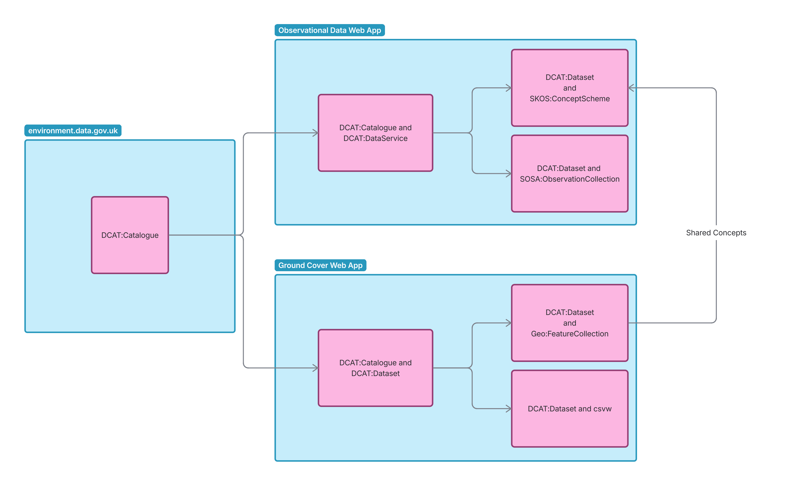
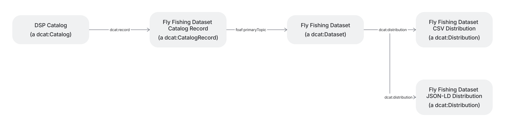
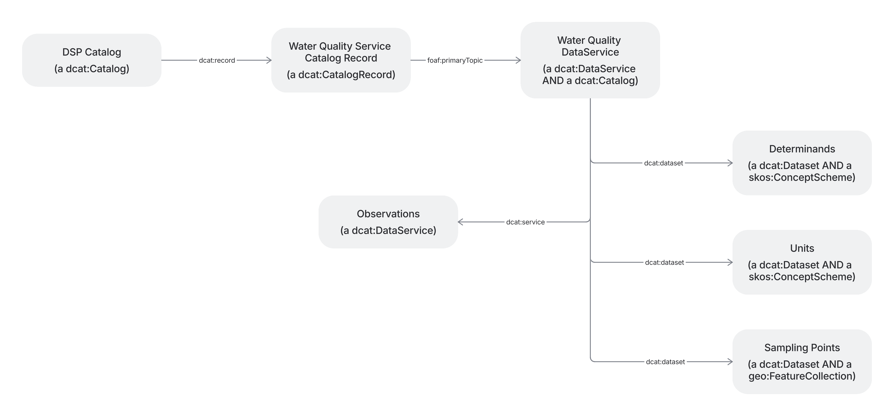
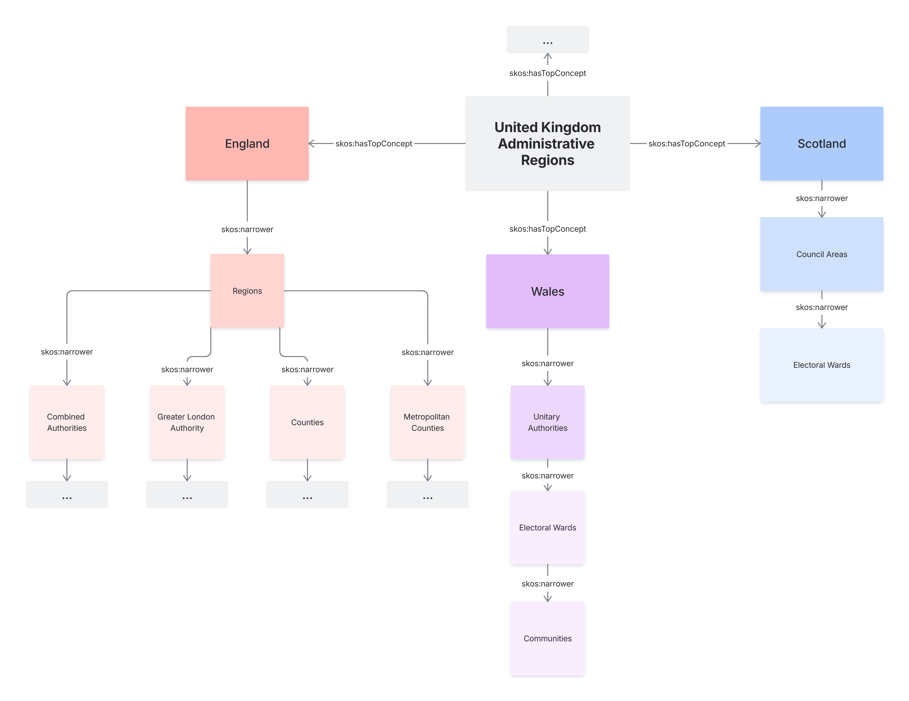

DSP Application Profile
***********************

:Author: Andrew Fergusson <andrew.fergusson@telespazio.com>, Pritam Bhudia <pritam.bhudia@telespazio.com>, Avery Vigolo <avery.vigolo@telespazio.com>
:Created: $Date: 2026-02-25 $
:Published: $Date: 2026-05-07 $
:Version: $Revision: 0.9 $

.. contents:: Table of contents

Introduction
============

Purpose and Scope
-----------------

This application profile defines the standards, vocabularies, and patterns required to publish and integrate
environmental data within the DEFRA Data Services Platform (DSP) federated data architecture. It applies to data
published on `environment.data.gov.uk <http://environment.data.gov.uk/>`__ by DEFRA and its arm's-length
bodies—including the Environment Agency—for third parties seeking to integrate with that data ecosystem.

The profile is not a replacement for domain-specific data standards. It is a **composability layer**: a set of
conventions that allow independently managed systems to share meaning without requiring schema convergence or custom
integration code. Adopting this profile is the mechanism by which a system becomes part of DEFRA's federated data
landscape.

The Problem This Profile Addresses
----------------------------------

DEFRA's environmental data estate spans dozens of applications, APIs, and portals—each developed independently across
several years, each using its own terminology, and each requiring bespoke effort to connect to any other. The cost of
integration grows exponentially with the number of systems: connecting the 28th system has historically required
understanding and mapping to each of the 27 that came before it.

This fragmentation has direct consequences for data users. Finding relevant data requires simultaneous domain expertise
and technical knowledge of individual systems. Cross-domain analysis—linking water quality measurements to biodiversity
observations and land use classifications, for example—demands manual effort that is rarely proportionate to its value.
Data held in end-of-life systems risks becoming inaccessible when those systems are retired.

This application profile addresses these problems by establishing a shared semantic layer built on W3C Linked Data
standards. Systems that adopt the profile express how their data relates to shared vocabularies **once**; the federated
architecture handles the connections automatically, at linear rather than exponential cost.

FAIR Principles and the Linked Data Ecosystem
---------------------------------------------

This profile is grounded in the `FAIR data principles <https://www.go-fair.org/fair-principles/>`__ —Findable,
Accessible, Interoperable, and Reusable—which provide the framework for making environmental data a long-term asset
rather than a short-term artefact.

W3C's Linked Data ecosystem is the primary technical mechanism by which FAIR principles are operationalised at scale:

.. list-table::
   :header-rows: 1

   * - FAIR Principle
     - What It Requires
     - How Linked Data Enables It
   * - **Findable**
     - Persistent identifiers; rich, indexed metadata
     - Every resource is assigned a dereferenceable URI; datasets are described using DCAT and published to federated catalogues automatically
   * - **Accessible**
     - Retrievable via open, standardised protocols
     - HTTP content negotiation serves the same resource as web pages, CSV, GeoJSON, or RDF—no specialist tooling required
   * - **Interoperable**
     - Data uses shared vocabularies and formal knowledge representations
     - W3C standards (RDF, SKOS, SOSA/SSN, OWL) provide machine-readable shared meaning; relationships between domain-specific terms and cross-domain concepts are declared explicitly
   * - **Reusable**
     - Rich provenance, licensing, and domain-relevant context
     - Versioned vocabularies, dataset-level provenance metadata, and standards-compliant licensing declarations ensure data can be understood and reused beyond its originating system

A key design principle of this profile is **semantics sooner**: establishing relationships between datasets early, and
refining definitions over time, is explicitly preferred over waiting for perfect consensus before publishing.
Relationships expressed under this profile survive vocabulary evolution; tightly coupled custom integrations do not.

Six Data Types
--------------

Environmental data within the DEFRA ecosystem is diverse in structure,
granularity, and purpose. This profile addresses six broad categories,
each with its own standards alignment and integration conventions:

1. **Catalogue** — Discovery metadata describing datasets, services, and their relationships. Enables users to find data
   across the ecosystem without knowing which system holds it. Aligned to DCAT.
2. **Concept** — Controlled vocabularies, code lists, and taxonomies. Provides the shared meaning that allows different
   domains to recognise equivalent terms—“Sampling Point" in water quality and “Observation Site" in ecology refer to
   the same concept. Aligned to SKOS.
3. **Geographies** — Named locations with spatial extents: sampling points, catchment boundaries, administrative areas,
   and designated sites. A location defined once can serve planning, biodiversity monitoring, and water quality
   reporting simultaneously. Aligned to GeoSPARQL with GeoJSON and WKT representations.
4. **Complex Classes** — Domain-specific entities with structured attributes: organisations, permits, consents, assets,
   and similar objects whose richness cannot be reduced to a flat table. Aligned to domain ontologies with OWL-based
   class definitions.
5. **Observations** — Measurement data: the readings produced by sensors, surveys, and sampling programmes. The most
   voluminous data type in environmental monitoring, and the one most critical to cross-domain analysis. Aligned to W3C
   SOSA/SSN.
6. **Cubes** — Pre-aggregated statistical summaries: annual averages, spatial aggregations, indicator time series.
   Enables fast access to derived data without re-processing raw observations for every query.

Each section of this profile specifies the mandatory and recommended
properties, vocabulary bindings, and serialisation formats for its
respective data type.

Integration with DEFRA and Environment Agency Data
--------------------------------------------------

Systems integrating with the DEFRA data ecosystem under this profile are not required to replace their internal data
models. The shared semantic layer operates above existing systems: adopting systems declare how their entities, terms,
and measurements relate to the shared vocabularies defined in this profile, enabling consistent discovery and access
across domain boundaries.

Integration follows a progressive model:


- **Minimum compliance** — Publish dataset-level catalogue metadata (DCAT) with persistent URIs and a machine-readable
  licence. This makes data findable and accessible with minimal implementation effort.
- **Vocabulary alignment** — Map domain-specific code lists and classifications to SKOS concept schemes. This enables
  consistent term resolution across domains.
- **Observation alignment** — Express measurement data using SOSA/SSN patterns. This enables water quality, ecology,
  hydrology, and other observational datasets to share a common structure.
- **Full alignment** — Expose data through standards-compliant RESTful API endpoints following the conventions in this
  profile. This enables consumers to perform their own cross-domain queries by combining responses from multiple
  endpoints using shared identifiers and vocabularies.

Each level of compliance delivers independent value; full alignment is not a prerequisite for participation. The
architecture is designed so that a system at minimum compliance can be progressively enhanced without breaking existing
integrations or requiring external systems to change.

Cross-domain data integration is achieved by consumers using DEFRA's RESTful API endpoints directly. Because all aligned
datasets share persistent URIs and common vocabularies, data retrieved from multiple endpoints can be combined without
custom mapping—the shared identifiers do the joining. This approach keeps the architecture composable and practical:
consumers use familiar HTTP-based tools, and integration complexity remains with the standards rather than with bespoke
infrastructure.

*This profile is maintained by the DEFRA Data Services Platform programme. Versioning follows semantic versioning
conventions; changes to mandatory properties constitute a major version increment. Implementers are encouraged to engage
with the programme team early in development to ensure alignment.*

Conventions
===========

Linked data examples in this document may be provided in `Turtle <https://www.w3.org/TeamSubmission/turtle/>`__ or
`JSON-LD <https://json-ld.org/>`__ formats as appropriate.

Terms
-----

In this document, we use standard linked data & RDF terms, so it may be helpful to read through the `RDF Primer
<https://www.w3.org/TR/rdf11-primer/#section-Introduction>`__.

Here is a quick summary of terms for reference:

.. list-table::
   :header-rows: 1

   * - Term
     - Definition

   * - Resource
     - Anything that can be described

   * - Uniform Resource Identifier (URI)
     - A character string which identifies a resource. Limited to ASCII character space (similar to a URL but not necessarily accessible via HTTP requests).

   * - Internationalized Resource Identifier (IRI)
     - A character string which identifies a resource. Like a URL or URI, but more general, accepting a greater range of characters.

   * - Literal
     - A basic value such as a string, integer, real number. Strings may be tagged with a language.

   * - Triple (Subject, Predicate, Object)
     - A statement about the Subject resource (URI), using a Predicate URI, about an Object, which may be an URI or a Literal.

       If the Object is also an URI, the statement establishes a relationship between the Subject & Object.

       In other terms, each statement can generally be described to assign an attribute (*Predicate*) to the *Subject* object, with the value being the *Object*.

   * - Namespace
     - An alias for an URI prefix, used for convenience to keep predicates short and to improve readability

   * - Domain
     - Permitted types of subjects for a given predicate

   * - Range
     - Permitted data types of objects for a given predicate, which must be respected.

       The term “includes" is used to make the range less restrictive, downgrading “must" into “should".

       When the phrase a <data type> is used, this indicates the object must be the value of an URI of a resource of the given data type.

   * - Cardinality
     - The number of times a predicate may be used per given subject.

       - ``1``: Exactly one
       - ``0..1``: At most one
       - ``1..*``: At least one
       - ``0..*``: Any number of times

   * - Coining
     - The act of assigning an URI (identifier) to a resource. A resource without a name is called a blank node.

   * - Blank node
     - A resource without a name.

       In Turtle syntax, blank nodes may be labelled for reuse, or nested, see RDF 1.1 Turtle.

       .. code:: ttl

         # Labelled blank nodes
         _:blank1 <predicate> _:blank2 .
         _:blank1 <predicate> _:blank3 .

         # A statement involving a nested blank node

         _:blank1 <predicate> [ rdfs:label "A nested blank node"; ] .

   * - Slugification
     - The process of making a string a valid component of a URL.

       For the purpose of this document, this involves:

       - Replacing Latin characters using diacritics with the same characters excluding diacritics
       - Removing remaining non-ASCII characters
       - Replacing groups of whitespace characters with dashes (-)
       - Decapitalising all characters

Namespaces
----------

.. list-table::
   :header-rows: 1

   * - Namespace
     - Namespace URI
     - Specification

   * - ``dcat:``
     - `<http://www.w3.org/ns/dcat#>`__
     - `Data Catalog Vocabulary (DCAT) - Version 3 <https://www.w3.org/TR/vocab-dcat-3/>`__

   * - ``dcterms:``
     - `<http://purl.org/dc/terms/>`__
     - `DCMI Metadata Terms <https://www.dublincore.org/specifications/dublin-core/dcmi-terms/>`__

   * - ``ddiam:``
     - `<http://vocabularies.cessda.eu/urn/urn:ddi:int.ddi.cv:AggregationMethod:1.1.2/>`__
     - `DDI Alliance Controlled Vocabulary for Aggregation Method <https://rdf-vocabulary.ddialliance.org/ddi-cv/AggregationMethod/1.0.0/AggregationMethod.html>`__

   * - ``foaf:``
     - `<http://xmlns.com/foaf/0.1/>`__
     - `FOAF Vocabulary Specification 0.99 <https://xmlns.com/foaf/spec/>`__

   * - ``geo:``
     - `<http://www.opengis.net/ont/geosparql#>`__
     - `OGC GeoSPARQL - A Geographic Query Language for RDF Data <https://docs.ogc.org/is/22-047r1/22-047r1.html>`__

   * - ``iop:``
     - `<http://w3id.org/iadopt/ont/>`__
     - `I-ADOPT Framework ontology <https://i-adopt.github.io/ontology/>`__

   * - ``owl:``
     - `<http://www.w3.org/2002/07/owl#>`__
     - `OWL Ontology <https://www.w3.org/2002/07/owl#>`__

   * - ``prov:``
     - `<http://www.w3.org/TR/prov-o/>`__
     - `PROV-O: The PROV Ontology <https://www.w3.org/TR/prov-o/>`__

   * - ``qb:``
     - `<http://purl.org/linked-data/cube#>`__
     - `RDF Data Cube Vocabulary <https://www.w3.org/TR/vocab-data-cube/>`__

   * - ``qudt:``
     - `<http://qudt.org/schema/qudt/>`__
     - `qudt.org <https://qudt.org/>`__

   * - ``rdf:``
     - `<http://www.w3.org/1999/02/22-rdf-syntax-ns#>`__
     - `The RDF Concepts Vocabulary (RDF) <https://www.w3.org/1999/02/22-rdf-syntax-ns#>`__

   * - ``rdfs:``
     - `<http://www.w3.org/2000/01/rdf-schema#>`__
     - `RDFS (Resource Description Framework Schema) Vocabulary <https://www.w3.org/TR/rdf-schema/>`__

   * - ``schema:``
     - `<http://www.schema.org/>`__
     - `Schema.org <https://www.schema.org/>`__

   * - ``skos:``
     - `<http://www.w3.org/2004/02/skos/core#>`__
     - `Simple Knowledge Organization System (SKOS) <https://www.w3.org/TR/skos-reference/>`__

   * - ``sosa:``
     - `<http://www.w3.org/ns/sosa/>`__
     - `Semantic Sensor Network Ontology - 2023 Edition <https://w3c.github.io/sdw-sosa-ssn/ssn/>`__

   * - ``unit:``
     - `<http://qudt.org/vocab/unit/>`__
     - `qudt.org <https://qudt.org/>`__

   * - ``xsd:``
     - `<http://www.w3.org/2001/XMLSchema#>`__
     - `W3C XML Schema Definition Language (XSD) 1.1 Part 2: Datatypes <https://www.w3.org/TR/xmlschema11-2/>`__

Overview Diagram
================

.. TODO: convert diagram to mermaid


     Overview diagram of the DSP-3 application registry.
     A box labeled environment.data.gov.uk contains a dcat:Catalogue.
     This dcat:Catalgue points into two other dcat:Catalogues in two other boxes, these boxes are labeled Observational
     Data Web App and Ground Cover Web App.
     The dcat:Catalogue in the Observational Data box is also a dcat:DataService, and points to two dcat:Datasets: the
     dataset is also a skos:ConceptScheme, the second dataset is also a sosa:ObservationCollection.
     The dcat:Catalogue in the Ground Cover box is also a dcat:Dataset, and points to two dcat:Datasets: the
     dataset is also a skos:ConceptScheme, the second dataset also provides csvw.
     The skos:ConceptSchemes in both boxes are linked together, showing that they are shared concepts.
 

Data Types
==========

For the various data types, we provide guidelines to be followed for our
own purposes.

We provide the predicates that must, should, and may be used for each given subject of the data type, as well as the
ranges of their possible objects, and their cardinality, i.e. how many times they may be specified for the given
subject. These specifications are intended to produce high quality, meaningful, and comprehensible linked data. See
`Terms`_ for a definition and explanation of Range and Cardinality for this document.

In the case where the valid predicates, ranges, or cardinalities differ from their respective original ontologies, the
rules in this application profile should supersede them.

1. Catalogue
------------

``dcat:Dataset``
~~~~~~~~~~~~~~~~

   dcat:Dataset represents a collection of data, published or curated by a single agent or identifiable community. The
   notion of dataset in DCAT is broad and inclusive, with the intention of accommodating resource types arising from all
   communities. Data comes in many forms including numbers, text, pixels, imagery, sound and other multi-media, and
   potentially other types, any of which might be collected into a dataset.

   – DCAT spec

We use Datasets for each conceptual group of data.

Each dataset should be part of a ``dcat:Catalog``, which should be specified using ``dcat:dataset`` on the ``dcat:Catalog``.

Temporal datasets are ones which only relate to, or are only valid for, a specific period of time. For temporal
datasets, ``dcterms:temporal`` must be used to indicate that period of time.

A ``dcat:Dataset`` may also be a ``skos:ConceptScheme``.

When we import versioned datasets, if each version of dataset also contains data from previous versions, we should
import and keep only the latest version.

Otherwise, we should make multiple versions of a dataset available. The related datasets should be linked together using
``dcat:previousVersion`` and ``dcat:nextVersion``. The latest version should be linked to using ``dcat:hasCurrentVersion`` in the
``dcat:Catalog`` which contains the versioned datasets.

.. TODO: dcat:DatasetSeries, dcat:inSeries.

.. list-table::
   :header-rows: 1

   * - Predicate
     - Range
     - Requirement
     - Cardinality
     - Notes

   * - ``dcterms:title``
     - Literal ``xsd:string``
     - Must
     - ``1..*``
     - May be repeated for multiple languages

   * - ``dcterms:description``
     - Literal ``xsd:string``
     - Must
     - ``1..*``
     - May be repeated for multiple languages

   * - ``dcterms:publisher``
     - Includes URI
     - Must
     - ``1``
     - Defaults to ``dcat:publisher`` of the ``dcat:Catalog``.

       May be URL of the publisher’s website, e.g. `<https://environment.data.gov.uk/>`__.

       May default as appropriate

   * - ``dcterms:license``
     - Includes URI
     - Must
     - ``1..*``
     - May be the URL of the license text, e.g. `<https://www.nationalarchives.gov.uk/doc/open-government-licence/version/3/>`__

   * - ``dcterms:created``
     - Literal ``xsd:dateTime``
     - Must
     - ``1``
     - Defaults to now()

   * - ``dcterms:temporal``
     - a ``dcterms:PeriodOfTime``
     - Must, if dataset is temporal
     - ``0..1``
     - If the dataset is only relates to a specific period of time.

       E.g.

       .. code:: ttl

         dcterms:temporal [
           a dcterms:PeriodOfTime ;

           # Start date is inclusive, end date is exclusive.
           # Dataset does not apply from 2026-01-01 onwards.

           dcat:startDate "2025-01-01"^^xsd:date ;
           dcat:endDate "2026-01-01"^^xsd:date ;
         ];

   * - ``dcterms:accrualPeriodicity``
     - a ``dcterms:Frequency``
     - Should
     - ``0..1``
     - If versions of the dataset is published regularly, especially if the dataset is temporal, the frequency at which it is published. E.g. yearly.

   * - ``dcterms:creator``
     - Includes URI
     - Should
     - ``0..1``
     - If publisher is not the creator

   * - ``dcterms:issued``
     - Literal ``xsd:date``
     - Should
     - ``0..1``
     - If specified by the publisher

   * - ``foaf:page``
     - Includes URI
     - Should
     - ``0..*``
     - If available, a web-resolvable URL to human-readable documentation of the Dataset.

   * - ``dcat:temporalResolution``
     - Literal ``xsd:duration``
     - Should
     - ``0..1``
     - If the dataset is computed, or is a cube, and has a time period, this is the minimum time period within the cube.

   * - ``dcat:contactPoint``
     - a ``vcard:Kind``
     - Should
     - ``0..*``
     - Contact point for support about the Dataset/DataService

   * - ``dcat:inCatalog``
     - a ``dcat:Catalog``
     - Should
     - ``0..*``
     - Parent catalog(s) this dataset belongs to

   * - ``dcat:theme``
     - a ``skos:Concept``
     - Should
     - ``0..*``
     - Themes, topics this dataservice covers. E.g. environment, rivers, water quality.

   * - ``dcat:downloadURL``
     - URI
     - May
     - ``0..*``
     - If provided by the publisher. Provides a direct download link for the source of our data. Should be a web-resolvable URL.

   * - ``dcterms:source``
     - a ``rdfs:Resource`` with ``rdfs:label``
     - May
     - ``0..*``
     - If a URL cannot be provided in ``dcat:accessURL``, a human-readable description of the source.

       .. code:: ttl

         dcterms:source [
           rdfs:label ""@en
         ]

   * - ``dcterms:language``
     - Literal ISO 639-1 two-letter or ISO 639-2 three-letter code ``xsd:string``
     - May
     - ``0..*``
     - If specified, and not just English.
       E.g. ``dcterms:language "en", “cy" ;`` for both English and Welsh (Cymraeg).

   * - ``skos:editorialNote``
     - Literal ``xsd:string``
     - May
     - ``0..*``
     - Additional meta information about the Dataset.

       .. code:: ttl

         skos:editorialNote "Missing data for X due to Y.
         Data applies for the year 2020 but 2020-12 is
         present in 2021's dataset due to Z."@en

..
  AV: There are also some more subjective predicates like dcat:theme, but I think we should be specific about these,
  probably subclass for our purposes, if appropriate.

``dcat:DataService``
~~~~~~~~~~~~~~~~~~~~

   A collection of operations that provides access to one or more datasets or data processing functions.

   – DCAT spec

A ``dcat:DataService`` may also be a ``dcat:Catalog``. The distinction between a plain catalogue and a data service is fuzzy. A
general rule of thumb is, if the catalog provides access to ``dcat:Distribution``\ s, a catalogue is probably also data
service. If properly representing the dataset would require using ``dcterms:temporal``, ``dcterms:spatial``, or ``dcat:inSerie``\ s,
it should be represented with a ``dcat:Dataset``.

.. list-table::
   :header-rows: 1

   * - Predicate
     - Range
     - Requirement
     - Cardinality
     - Notes

   * - ``dcat:endpointURL``
     - URI
     - Must
     - ``1``
     - Web-resolvable URI to the endpoint which serves datasets.

   * - ``dcat:servesDataset``
     - URI
     - Should
     - ``0..*``
     - ``dcat:Dataset``\ s provided by this service.

   * - ``dcat:endpointDescription``
     - Includes URI
     - Should
     - ``0..1``
     - If available, a reference to the documentation of the Dataset. Preferably machine-readable, or for programmatic access such as a Swagger documentation page. If nothing machine-readable is available, should duplicate ``foaf:page``.

       May be a web-resolvable URL.

   * - ``dcat:theme``
     - a ``skos:Concept``
     - Should
     - ``0..*``
     - Themes, topics this dataservice covers. E.g. environment, rivers, water quality.

   * - ``dcterms:type``
     - Includes a ``skos:Concept``
     - May
     - ``0..*``
     - Types of operations supported by the service. E.g. view, update, download,

``dcat:Catalog``
~~~~~~~~~~~~~~~~

   dcat:Catalog represents a catalog, which is a dataset in which each individual item is a metadata record describing
   some resource; the scope of dcat:Catalog is collections of metadata about **datasets**, **data services**, or other
   resource types.

   – DCAT spec

Each dataset should be part of a ``dcat:Catalog``, which should be specified using ``dcat:inCatalog`` on the ``dcat:Dataset``.

A Catalog is a specialisation of ``dcat:Dataset``, adding only the predicate ``dcat:dataset`` to specify its members.

.. list-table::
   :header-rows: 1

   * - Predicate
     - Range
     - Requirement
     - Cardinality
     - Notes

   * - ``dcterms:title``
     - Literal ``xsd:string``
     - Must
     - ``1..*``
     -

   * - ``dcterms:description``
     - Literal ``xsd:string``
     - Must
     - ``1..*``
     -

   * - ``dcat:contactPoint``
     - a ``vcard:Kind``
     - Should
     - ``0..*``
     - Contact point for support about the catalog specifically, not the datasets or entries contained within. May be set to an appropriate default for the service.

   * - ``dcterms:license``
     - Includes URI
     - Should
     - ``0..*``
     - License for the catalog specifically, not the datasets or entries contained within. May be set to an appropriate default for the service.

   * - ``dcterms:publisher``
     - Includes URI
     - Should
     - ``0..*``
     - Publisher of the catalog specifically, not the datasets or entries contained within. May be set to an appropriate default for the service.

``dcat:CatalogRecord``
~~~~~~~~~~~~~~~~~~~~~~

   A record in a catalog, describing the registration of a single dcat:Resource.

   This class is optional and not all catalogs will use it. It exists for catalogs where a distinction is made between
   metadata about a *dataset or service* and metadata about the *entry in the catalog about the dataset or service*. For
   example, the *publication date* property of the *dataset* reflects the date when the information was originally made
   available by the publishing agency, while the publication date of the *catalog record* is the date when the dataset
   was added to the catalog.

   – DCAT spec

We use ``dcat:CatalogRecord``\ s to provide references to external resources not directly provided by, or out of scope of, the
service providing the ``dcat:Catalog``.

For example, the UK government open data portal is provided at `data.gov.uk <https://www.data.gov.uk/>`__, and provides
various sections for its various departments and subjects, analogous to ``dcat:Catalog``\ s. The Environment catalog has a
listing for the `Water Quality Explorer <https://www.data.gov.uk/dataset/583e771f-1af6-4934-b8f0-28f1d1ddd48c>`__, which
would be a ``dcat:CatalogRecord``, as it provides a description and some metadata about the dataset, including its license
and when it was last updated.

.. list-table::
   :header-rows: 1

   * - Predicate
     - Range
     - Requirement
     - Cardinality
     - Notes

   * - ``dcterms:title``
     - Literal ``xsd:string``
     - Must
     - ``1..*``
     -

   * - ``foaf:primaryTopic``
     - a ``dcat:Resource``, including a ``dcat:Dataset`` and a ``dcat:DataService``
     - Must
     - ``1``
     -

   * - ``dcterms:description``
     - Literal ``xsd:string``
     - Should
     - ``0..*``
     - Description of the resource this record points to

   * - ``dcterms:issued``
     - Includes Literal ``xsd:dateTime``
     - Should
     - ``0..1``
     - When the record was added to the catalog

   * - ``dcterms:modified``
     - Includes Literal ``xsd:dateTime``
     - May
     - ``0..*``
     - When the record was last updated or modified

   * - ``dcterms:conformsTo``
     - Includes a ``dcterms:Standard``
     - May
     - ``0..*``
     -
       .. TODO: Protocols supported by the resource? E.g. JSON-LD, SPARQL, GeoJSON, etc?

``dcat:Distribution``
~~~~~~~~~~~~~~~~~~~~~

   A specific representation of a dataset. A dataset might be available in multiple serializations that may differ in
   various ways, including natural language, media-type or format, schematic organization, temporal and spatial
   resolution, level of detail or profiles (which might specify any or all of the above).

   – DCAT spec

.. list-table::
   :header-rows: 1

   * - Predicate
     - Range
     - Requirement
     - Cardinality
     - Notes

   * - ``dcterms:title``
     - Literal ``xsd:String``
     - Must
     - ``1..*``
     -

   * - ``dcat:downloadURL``
     - URI
     - Must
     - ``1..1``
     -

   * - ``dcat:accessURL``
     - URI
     - Should
     - ``0..1``
     -

   * - ``dcat:accessService``
     - a ``dcat:DataService``
     - Should
     - ``0..1``
     -

   * - ``dcat:description``
     - Literal ``xsd:string``
     - Should
     - ``0..*``
     -

   * - ``dcterms:license``
     - URI
     - Should
     - ``0..1``
     -

   * - ``dcterms:mediaType``
     - a ``dcterms:MediaType``
     - May
     - ``1``
     -

   * - ``dcterms:format``
     - a ``dcterms:MediaTypeOrExtent``
     - May
     - ``0..1``
     -

   * - ``dcterms:compressFormat``
     - a ``dcterms:MediaType``
     - May
     - ``0..1``
     -

   * - ``dcat:packagingFormat``
     - a ``dcterms:MediaType``
     - May
     - ``0..1``
     -

   * - ``dcterms:modified``
     - Literal, including ``xsd:dateTime``
     - May
     - ``0..1``
     -

   * - ``dcat:temporalResolution``
     - Literal ``xsd:duration``
     - Should
     - ``0..1``
     - If the dataset is computed, or is a cube, and has a time period, this is the minimum time period within the cube.

   * - ``dcat:spatialResolutionInMeters``
     - Literal, including ``xsd:decimal``
     - May
     - ``0..1``
     -

   * - ``dcterms:issued``
     - Literal, including ``xsd:dateTime``
     - May
     - ``0..1``
     -

   * - ``dcterms:accessRights``
     - a ``dcterms:RightsStatement``
     - May
     - ``0..1``
     -

Catalogue JSON-LD mapping
~~~~~~~~~~~~~~~~~~~~~~~~~

.. list-table::
   :header-rows: 1

   * - RDF Attribute
     - JSON-LD key
     - JSON-LD value
     - Notes

   * - ``dcat:accessURL``
     - ``accessURL``
     - Literal value as string
     -

   * - ``dcterms:created``
     - ``issuedDate``
     - Literal value as string
     -

   * - ``dcterms:creator``
     - ``creator``
     - Literal value as string
     -

   * - ``dcterms:description``
     - ``description``
     - Literal value as string
     -

   * - ``dcat:downloadURL``
     - ``downloadURL``
     - Literal value as string
     -

   * - ``dcat:endpointDescription``
     - ``docs``
     - Literal value as string
     -

   * - ``dcterms:license``
     - ``license``
     - Literal value as string
     -

   * - ``dcterms:publisher``
     - ``publisher``
     - Literal value as string
     -

   * - ``dcat:temporalResolution``
     - ``temporalResolution``
     - Literal value as string
     -

   * - ``dcat:contactPoint``
     - ``contactPoint``
     - ``vcard:Kind`` as JSON-LD
     - For example

       .. code:: ttl

         dcat:contactPoint [
           a vcard:Organization ;

           vcard:hasTitle "The"@en ;
           vcard:hasOrganisationName "Environment Agency"@en ;
           vcard:hasURL <https://www.gov.uk/ea> ;
           vcard:hasEmail <mailto:enquiries@environment-agency.gov.uk> ;
           vcard:hasRole "Executive non-departmental public body"@en ;
         ] ;

   * - ``dcterms:title``
     - ``title``
     - Literal value as string
     -

   * - ``dcterms:issued``
     - ``issued``
     - Literal value as string
     -

   * - ``dcterms:language``
     - ``language``
     - Literal value as string
     -

   * - ``dcterms:modified``
     - ``lastModified``
     - Literal value as string
     -

   * - ``dcterms:source``
     - ``source``
     - Literal value as string
     -

   * - ``dcterms:temporal``
     - ``timeRange``
     - Object with start and end as string
     -

   * - ``dcterms:conformsTo``
     -
     -
     -

   * - ``dcat:theme``
     - ``theme``
     - ``skos:prefLabel`` of ``skos:Concept``
     -

   * - ``foaf:page``
     - ``humanDocs``
     - Literal value as string
     -

   * - ``foaf:primaryTopic``
     - ``primaryTopic``
     - URI as string
     -

   * - ``skos:editorialNote``
     - ``editorialNote``
     - Literal value as string
     -

   * -
     - ``hasDatasets``
     - URI
     - Applicable to ``dcat:Catalog``


Modelling datasets using DCAT
~~~~~~~~~~~~~~~~~~~~~~~~~~~~~

The diagram below shows how we model our datasets using DCAT

.. TODO: convert diagram to mermaid


     A hierarchy diagram. At the top, the DSP catalog, a dcat:Catalog, points with dcat:record to Fly Fishing, a
     dcat:CatalogRecord.
     This points with foaf:primaryTopic to Fly Fishing, a dcat:Dataset.
     This points to two dcat:Distributions, the first in CSV format, the second in JSON-LD format.

Modelling services using DCAT
~~~~~~~~~~~~~~~~~~~~~~~~~~~~~

The diagram below shows how we model our services using DCAT

.. TODO: convert diagram to mermaid


     A hierarchy diagram. At the top, the DSP catalog, a dcat:Catalog, points with dcat:record to Water Quality
     Serivce, a dcat:CatalogRecord. This points with foaf:primaryTopic to Water Quality, a dcat:DataService and
     dcat:Catalog. This points to four children.
     The first with dcat:dataset to Determinands, a dcat:Dataset and skos:ConceptScheme.
     The second with dcat:service to Observations, a dcat:DataService.
     The third with dcat:dataset to Units, a dcat:Dataset and skos:ConceptScheme.
     The fourth with dcat:dataset to Sampling Points, a dcat:Dataset and geo:FeatureCollection.

2. Concept
----------

``skos:ConceptScheme``
~~~~~~~~~~~~~~~~~~~~~~

   A SKOS concept scheme can be viewed as an aggregation of one or more SKOS concepts

   – SKOS spec

A ``skos:ConceptScheme`` must also be a ``dcat:Dataset``.

A ``skos:ConceptScheme`` must also contain at least one ``skos:Concept`` using the ``skos:topConceptOf`` predicate.

.. list-table::
   :header-rows: 1

   * - Predicate
     - Range
     - Requirement
     - Cardinality
     - Notes

   * - ``skos:prefLabel``
     - Literal ``xsd:string``
     - Must
     - ``1..*``
     - Human-readable name

   * - ``skos:notation``
     - Literal ``xsd:string``
     - Should
     - ``1``
     - Should be provided by the data source

   * - ``skos:definition``
     - Literal ``xsd:string``
     - Should
     - ``0..*``
     - Description or formal definition of the concept scheme

   * - ``skos:altLabel``
     - Literal ``xsd:string``
     - May
     - ``0..*``
     - Additional human-readable names

   * - ``skos:note``
     - Literal ``xsd:string``
     - May
     - ``0..*``
     - Additional information about the concept scheme

``skos:Concept``
~~~~~~~~~~~~~~~~

   A SKOS concept can be viewed as an idea or notion; a unit of thought. However, what constitutes a unit of thought is
   subjective, and this definition is meant to be suggestive, rather than restrictive.

   – SKOS spec

A ``skos:Concept`` must be linked to at least one ``skos:ConceptScheme`` using ``skos:inScheme``, and may be linked to any number
of those same concept schemes with ``skos:topConceptOf``.

A ``skos:Concept`` should use ``skos:broader`` and ``skos:narrower`` to indicate hierarchy.

.. list-table::
   :header-rows: 1

   * - Predicate
     - Range
     - Requirement
     - Cardinality
     - Notes

   * - ``skos:inScheme``
     - a ``skos:ConceptScheme``
     - Must
     - ``1``
     - Scheme(s) this concept belongs to

   * - ``skos:prefLabel``
     - Literal ``xsd:string``
     - Must
     - ``1..*``
     - Human-readable name

   * - ``skos:notation``
     - Literal ``xsd:string``
     - Must
     - ``1``
     - Should be provided by the data source

   * - ``skos:definition``
     - Literal ``xsd:string``
     - Should
     - ``0..*``
     - Description or formal definition of the concept

   * - | ``skos:broader``
       | ``skos:narrower``
     - a ``skos:Concept``
     - Should
     - ``0..*``
     - Hierarchical relationships

   * - ``skos:topConceptOf``
     - a ``skos:ConceptScheme``
     - May
     - ``0..*``
     - Inferred, should be present if the ``skos:Concept`` has no ``skos:broader`` relationship.

   * - ``skos:altLabel``
     - Literal ``xsd:string``
     - May
     - ``0..*``
     - Additional human-readable names

   * - ``skos:note``
     - Literal ``xsd:string``
     - May
     - ``0..*``
     - Additional information about the concept

   * - | ``skos:closeMatch``
       | ``skos:exactMatch``
       | ``skos:broadMatch``
       | ``skos:narrowMatch``
       | ``skos:relatedMatch``
     - a ``skos:Concept``
     - May
     - ``0..*``
     - To indicate related concepts

``skos:Collection``
~~~~~~~~~~~~~~~~~~~

   SKOS concept collections are labeled and/or ordered groups of SKOS concepts.

   Collections are useful where a group of concepts shares something in common, and it is convenient to group them under
   a common label, or where some concepts can be placed in a meaningful order

   – SKOS spec

When appropriate, ``skos:Concept``\ s are grouped together into ``skos:Collection``\ s with ``skos:member``. This can be nested, such
that a ``skos:Collection`` may contain other ``skos:Collection``\ s.

A collection can be treated as a dataset, therefore it may be a ``dcat:Dataset``.

Collections do not support hierarchy. If relationships are required between ``skos:Concept``\ s across multiple
``skos:ConceptScheme``\ s, those concepts should be duplicated into another scheme, and ``skos:exactMatch`` used to indicate they
are equivalent, then ``skos:narrower`` and ``skos:broader`` indicate as usual the hierarchy.

.. list-table::
   :header-rows: 1

   * - Predicate
     - Range
     - Requirement
     - Cardinality
     - Notes

   * - ``skos:member``
     - a ``skos:Collection`` or a ``skos:Concept``
     - Should
     - ``0..*``
     -

   * - ``rdfs:label``
     - Literal ``xsd:string``
     - May
     - ``0..*``
     -

Concept JSON-LD mapping
~~~~~~~~~~~~~~~~~~~~~~~

.. list-table::
   :header-rows: 1

   * - RDF Attribute
     - JSON-LD key
     - JSON-LD value
     - Notes

   * - ``skos:prefLabel``
     - ``prefLabel``
     - Literal value as string
     -

   * - ``skos:altLabel``
     - ``altLabel``
     - Literal value as string
     -

   * - ``skos:definition``
     - ``description``
     - Literal value as string
     -

   * - ``skos:note``
     - ``note``
     - Literal value as string
     -

   * - ``skos:broader``
     - ``broader``
     - JSON-LD encoded ``skos:Concept``
     -

   * - ``skos:narrower``
     - ``narrower``
     - JSON-LD encoded ``skos:Concept``
     -

   * -
     - ``hasTopConcepts``
     - Includes endpoint URI, or URI of ``skos:Concept``
     - Applicable to ``skos:ConceptScheme``.

       Inferred from children of the ``skos:ConceptScheme`` who are ``skos:topConceptOf`` – itself inferred by lack of ``skos:broader``. May be an endpoint which performs a query, or an automatically populated array

   * -
     - ``hasMembers``
     - Includes endpoint URI, or URI of resource
     - Applicable to ``skos:Collection``.

Concepts worked example
~~~~~~~~~~~~~~~~~~~~~~~

As of writing, the UK's administrative geographies are hierarchically
organised according to the following diagram:

.. TODO: convert diagram to mermaid


     A hierarchical diagram of the UK's adminmistrative regions.
     In the middle is "UK Administrative Regions", from which several arrows point out, labelled by skos:hasTopConcept.
     One skos:hasTopConcept arrow points to Scotland, which itself has an arrow labelled skos:narrower to Council Areas, which in turn indicats skos:narrower to Electoral Wards.
     Another skos:hasTopConcept arrow points to Wales, which points to skos:narrower Unitary Authorities, which points
     to skos:narrower Electoral Wards, which points to skos:narrower Communities.
     Another skos:hasTopConcept arrow points to England, which has the most complicated tree. England points to
     skos:narrower Regions, which branches of into skos:narrower Combined Authorities, Greater London Authority,
     Counties, and Metropolitan Counties. Each of those point to further skos:narrower concepts which are left unlabeled.


We would represent this with the following ``skos:ConceptScheme``:

-  The UK is broken down into Countries, each being a ``skos:topConceptOf`` of the UK, one of which being Wales

-  Wales is broken down into many ``skos:narrower`` Unitary Authorities

-  Each Unitary Authority is broken down into many ``skos:narrower`` Electoral Wards

-  Each Electoral Ward is broken down into many ``skos:narrower`` Communities

A subgraph of this relationship could be represented by the following RDF, using Government Statistical Service (GSS)
codes for notation:

.. code:: ttl

   @prefix ex: <http://www.example.org/> .
   @prefix skos: <http://www.w3.org/2004/02/skos/core#> .

   ex:UnitedKingdomAdministrativeRegions a skos:ConceptScheme ;
       skos:prefLabel "United Kingdom Administrative Regions"@en .

   ex:W92000004 a skos:Concept ;  # Country
       skos:inScheme ex:UnitedKingdomAdministrativeRegions ;
       skos:notation "W92000004" ;
       skos:prefLabel "Cymru"@cy, "Wales"@en ;
       skos:note "Established in 1057"@en ;
       skos:topConceptOf ex:UnitedKingdomAdministrativeRegions .

   ex:W06000015 a skos:Concept ;  # Unitary Authority
       skos:inScheme ex:UnitedKingdomAdministrativeRegions ;
       skos:broader ex:W92000004 ;
       skos:notation "W06000015" ;
       skos:prefLabel "Cyngor Caerdydd"@cy, "Cardiff Council"@en .

   ex:W05001274 a skos:Concept ;  # Electoral Ward
       skos:inScheme ex:UnitedKingdomAdministrativeRegions ;
       skos:broader ex:W06000015 ;
       skos:notation "W05001274" ;
       skos:prefLabel "Cathays"@cy, "Cathays"@en .

   ex:W06000011 a skos:Concept ;  # Unitary Authority
       skos:inScheme ex:UnitedKingdomAdministrativeRegions ;
       skos:broader ex:W92000004 ;
       skos:notation "W06000011" ;
       skos:prefLabel "Cyngor Abertawe"@cy, "Swansea Council"@en .

   ex:W39000434 a skos:Concept ;  # Electoral Ward and Community
       skos:inScheme ex:UnitedKingdomAdministrativeRegions ;
       skos:broader ex:W06000011 ;
       skos:notation "W39000434" ;
       skos:prefLabel "Castell"@cy, "Castle"@en .

Each region, regardless of their position in the hierarchy, is ``skos:inScheme`` the ``skos:ConceptScheme`` containing
“administrative regions". Their hierarchical relationships are in this case represented by the lower administrative
regions using ``skos:broader`` to refer to the higher region they belong. Equally valid, the higher administrative regions
could use ``skos:narrower`` to refer to all the lower regions contained within them.

3. Geography
------------

``geo:FeatureCollection``
~~~~~~~~~~~~~~~~~~~~~~~~~

   A collection of individual Features

   – OGC GeoSPARQL spec

..

   An instance of geo:FeatureCollection should have at least one outgoing rdfs:member relation

   – OGC GeoSPARQL spec

We use ``geo:FeatureCollection``\ s to group related geographic features, such as water quality sampling points, or
administrative regions.

Each ``geo:FeatureCollection`` must also be a ``dcat:Dataset``, and follow all requirements of a ``dcat:Dataset``.

When a ``geo:FeatureCollection`` represents commonly understood geographies, e.g. cities or countries, ``geo:FeatureCollection``
should also be a ``skos:ConceptScheme``, in which case it should follow all requirements of a ``skos:ConceptScheme``.

.. list-table::
   :header-rows: 1

   * - Predicate
     - Range
     - Requirement
     - Cardinality
     - Notes

   * - ``rdfs:member``
     - a ``geo:Feature``
     - Should
     - ``0..*``
     -

``geo:Feature``
~~~~~~~~~~~~~~~

   Feature represents a uniquely identifiable phenomenon, for example a river or an apple. While such phenomena (and
   therefore the Features used to represent them) are bounded, their boundaries may be crisp (e.g., the declared
   boundaries of a state), vague (e.g., the delineation of a valley versus its neighboring mountains), and change with
   time (e.g., a storm front). While discrete in nature, Features may be created from continuous observations, such as
   an isochrone that determines the region that can be reached by ambulance within 5 minutes

   – OGC GeoSPARQL spec

We use ``geo:Feature``\ s to represent individual geographic features or regions, such as a city, or an administrative region.

When a ``geo:Feature`` represents a commonly understood geography, e.g. a city or country, it should also be a ``skos:Concept``,
in which case it should follow all requirements of a ``skos:Concept``.

Where a conceptual geography has inexact or unavailable boundaries, it is typed as a ``skos:Concept`` rather than a
``geo:Feature``. Its spatial nature can be inferred from context: where other ``geo:Feature`` instances are declared
``geo:sfWithin`` it, users may treat it as an implicit ``geo:Feature``.

.. list-table::
   :header-rows: 1

   * - Predicate
     - Range
     - Requirement
     - Cardinality
     - Notes

   * - ``geo:hasGeometry``
     - a ``geo:Geometry``
     - Should
     - ``1``
     -

   * - | ``geo:sfWithin``
       | ``geo:sfContains``
     - a ``geo:Feature``
     - Should
     - ``1..*``
     - Any boundaries which a feature exists within, or features which are contained within a boundary, should be linked via ``geo:sfWithin`` or ``geo:sfContains`` respectively.

``geo:Geometry``
~~~~~~~~~~~~~~~~

   A coherent set of direct positions in space. The positions are held within a Spatial Reference System (SRS).

   – OGC GeoSPARQL spec

We use geometries to store the precise bounding area of a geography, in well-known text format using the ``geo:hasWKT``
predicate. Usually, this geometry should be encoded as a MultiPolygon, to support geographies composed of multiple
distinct shapes. For example, islands

For convenience, we should provide the bounding box and centroid of a geography with ``geo:hasBoundingBox`` and
``geo:hasCentroid`` respectively.

Geometries should be provided with the following shapes and anchors if coined:

.. list-table::
   :header-rows: 1

   * - Geometry
     - Shape type
     - Anchor (if coined)
     - Notes

   * - Full geometry
     - MultiPolygon or Polygon
     - ``#geometry``
     - If the geometry is non-contiguous, a MultiPolygon should be used.

   * - Bounding box
     - Polygon
     - ``#bbox``
     -

   * - Centroid
     - Point
     - ``#centroid``
     -

.. list-table::
   :header-rows: 1

   * - Predicate
     - Range
     - Requirement
     - Cardinality
     - Notes

   * - ``geo:asWKT``
     - Literal ``geo:wktLiteral``
     - Must
     - ``1``
     - Must explicitly encode the spatial reference system, which should be `EPSG:4326 <https://epsg.io/4326>`__, unless a different system is requested:

       .. code:: ttl

         geo:asWkt "<http://www.opengis.net/def/crs/EPSG/0/4326> POINT(-1.150 52.9534)"^^geo:wktLiteral"

   * - ``geo:coordinateDimension``
     - Literal ``xsd:decimal``
     - Must
     - ``1``
     - Number of axes in the geometry

   * - ``geo:hasBoundingBox``
     - a ``geo:Geometry``
     - Should
     - ``0..1``
     - Should be provided if the geometry is at least 2-dimensional, unless this geometry represents another’s bounding box.

       Should be a Polygon

   * - ``geo:hasCentroid``
     - a ``geo:Geometry``
     - Should
     - ``0..1``
     - Should be provided if the geometry is at least 2-dimensional.

       Should be provided as a WKT Point.

Geography JSON-LD mapping
~~~~~~~~~~~~~~~~~~~~~~~~~

.. list-table::
   :header-rows: 1

   * - RDF Attribute
     - JSON-LD key
     - JSON-LD value
     - Notes

   * - ``geo:hasGeometry``
     - ``geometry``
     - ``geo:Geometry`` object serialised as JSON-LD
     -

   * - ``geo:asWKT``
     - ``asWKT``
     - Literal value as string
     -

   * - ``geo:hasBoundingBox``
     - ``bbox``
     - ``geo:Geometry`` object serialised as JSON-LD
     -

   * - ``geo:hasCentroid``
     - ``centroid``
     - ``geo:Geometry`` object serialised as JSON-LD
     -

   * - ``geo:coordinateDimension``
     - ``coordinateDimension``
     - Literal value as integer
     -

   * - ``geo:sfWithin``
     - Name of the classification of Feature which contains this ``geo:Feature``, in camelCase
     - ``geo:Feature`` object serialised as JSON-LD
     - Only keys … of related ``geo:Feature``

       .. TODO: which keys?

GeoJSON mapping
~~~~~~~~~~~~~~~

When transferring geographies via our APIs, we may support using `GeoJSON <https://geojson.org/>`__ (MIME
application/geo+json) to encode them, if it is requested via the Accept header.

RDF resources and attributes and should be provided in the properties of the GeoJSON object, according to the following
mapping:

.. list-table::
   :header-rows: 1

   * - RDF Attribute
     - GeoJSON key
     - GeoJSON value
     - Notes

   * -
     - ``isDistributionOf``
     - Resource URL
     - The URL of the Resource from which this GeoJSON object was generated

   * - ``skos:notation``
     - ``notation``
     - Literal value as string
     -

   * - ``skos:prefLabel``
     - ``name``
     - Literal value as string
     -

   * - ``skos:altLabel``
     - ``altName``
     - Literal value as string
     -

   * - ``skos:definition``
     - ``description``
     - Literal value as string
     -

   * - ``skos:note``
     - ``note``
     - Literal value as string
     -

.. NOTE:: We may implement Accept-Language to support non-English serializations when the serialization doesn't support
   multiple languages via overloading. For now English-by-default.

Each ``skos:Concept`` assigned to the ``geo:Feature`` should also be present in the properties of the GeoJSON object, with the
camelCase name of its ``skos:ConceptSchemeused`` as the key, and the ``skos:Concept``'s ``skos:prefLabel`` as the value. See the
`worked example <Geography worked example>`_ below.

The properties should generally not contain complex data types such as objects. Arrays may be used when appropriate.

Geography worked example
~~~~~~~~~~~~~~~~~~~~~~~~

The water quality sampling point endpoint for AN-CORBY returns the following JSON-LD response, which has been cut down
for simplicity:

.. code:: json

   {
     "id": "https://environment.data.gov.uk/water-quality/sampling-point/AN-CORBY",
     "@type": [
       "sosa:FeatureOfInterest",
       "geo:Feature"
     ],
     "altLabel": "CORBY STW F/E",
     "prefLabel": "CORBY STW FINAL EFFLUENT",
     "notation": "AN-CORBY",
     "hasObservations": "https://environment.data.gov.uk/water-quality/sampling-point/AN-CORBY/observation",
     "geometry": {
       "id": "https://environment.data.gov.uk/water-quality/sampling-point/AN-CORBY#Geometry",
       "@type": "geo:Geometry",
       "asWKT": "POINT(-0.665 52.4901) <http://www.opengis.net/def/crs/EPSG/0/4326>"
     },
     "samplingPointStatus": {
       "@id": "_:status#O",
       "@type": [
         "skos:Concept",
         "sosa:Property"
       ],
       "prefLabel": "OPEN",
       "notation": "O"
     },
     "samplingPointType": {
       "@id": "_:samplingPointType#SA",
       "@type": [
         "skos:Concept",
         "sosa:Property"
       ],
       "prefLabel": "SEWAGE DISCHARGES - FINAL/TREATED EFFLUENT - WATER COMPANY",
       "notation": "SA"
     },
     "region": { ... },
     "area": { ... },
     "subArea": { ... }
   }

The same subject is transformed into the following GeoJSON when requested:

.. code:: json

   {
     "type": "Feature",
     "geometry": {
       "coordinates": [
         -0.665027896,
         52.490089102
       ],
       "type": "Point"
     },
     "properties": {
       "name": "CORBY STW FINAL EFFLUENT",
       "status": "OPEN",
       "type": "SEWAGE DISCHARGES - FINAL/TREATED EFFLUENT - WATER COMPANY",
       "region": "Anglian",
       "area": "ANGLIAN - LINCS AND NORTHANTS",
       "subArea": "L&W NORTH & SOUTH",
       "notation": "AN-CORBY",
       "isDistributionOf": "https://environment.data.gov.uk/water-quality/sampling-point/AN-CORBY"
     }
   }

4. Custom
---------

The data provided by our services uses terms from established vocabularies in order to improve interoperability. However
some vocabulary needed to describe our data are not represented in existing vocabulary and in these cases we define our
own classes and predicates.

RDF Schema (RDFS) and OWL vocabulary is used for defining new classes and predicates.

Classes
~~~~~~~

A new class is of type ``owl:Class`` and the following predicates are used to describe it:

.. list-table::
   :header-rows: 1

   * - Predicate
     - Range
     - Requirement
     - Cardinality
     - Notes

   * - ``rdfs:label``
     - Literal ``xsd:string``
     - Must
     - ``1``
     - The human-readable label of the class

   * - ``rdfs:comment``
     - Literal ``xsd:string``
     - Must
     - ``1``
     - A description of the class which provides more context about when the class should be used

   * - ``rdfs:subClassOf``
     - a ``rdfs:Class`` or a ``owl:Class``
     - May
     - ``0..*``
     - Used to indicate whether the class is a subclass of another class

Below is the pattern that we would use for defining an ``owl:Class``

.. code:: ttl

   ex:CustomClass a owl:Class ;
       rdfs:label "Custom Class"@en ;
       rdfs:comment "A domain-specific class" ;
       rdfs:subClassOf ex:ParentClass .

Predicates
~~~~~~~~~~

A new predicate can be of type ``owl:ObjectProperty`` (the range of the predicate is a URI) or of type ``owl:DatatypeProperty``
(the range of the predicate is a literal)

.. list-table::
   :header-rows: 1

   * - Predicate
     - Range
     - Requirement
     - Cardinality
     - Notes

   * - ``rdfs:label``
     - Literal ``xsd:string``
     - Must
     - ``1``
     - The human-readable label of the predicate

   * - ``rdfs:comment``
     - Literal ``xsd:string``
     - Must
     - ``1``
     - A description explaining the predicate

   * - ``rdfs:domain``
     - a ``rdfs:Class`` or a ``owl:Class``
     - Should
     - ``0..*``
     - The permitted class/classes that the predicate can be used on

   * - ``rdfs:range``
     - - a ``rdfs:Class`` or a ``owl:Class`` (if the property is an ``owl:ObjectProperty``)
       - a Literal datatype (if the property is an ``owl:DatatypeProperty`` e.g. if we declare ``ex:age`` to be an ``owl:DatatypeProperty`` then we would say ``ex:age rdfs:range xsd:integer``
     - Should
     - ``0..*``
     - The permitted data types of objects for the predicate

Below is the pattern that we would use for defining an ``owl:ObjectProperty`` and an ``owl:DatatypeProperty``

.. code:: ttl

   ex:customObjectProperty a owl:ObjectProperty ;
       rdfs:label "Custom Object Property"@en ;
       rdfs:comment "A custom object property" ;
       rdfs:domain ex:DomainClass ;
       rdfs:range ex:RangeClass .

   ex:customDatatypeProperty a owl:DatatypeProperty ;
     rdfs:label "Custom Datatype Property"@en ;
     rdfs:comment "A custom datatype property" ;
     rdfs:domain ex:DomainClass ;
     rdfs:range xsd:string .

Worked example: Data Requirements Library
~~~~~~~~~~~~~~~~~~~~~~~~~~~~~~~~~~~~~~~~~

Consider the Mudflats Asset Type within the Land Asset Category

.. list-table::
   :header-rows: 1

   * - Asset Type
     - Description
     - Asset Code
     - Uniclass
     - Geometry Type
     - Updates

   * - Mudflats
     - Coastal wetlands that form in intertidal areas where sediments have been deposited by tides or rivers. Mudflats are usually covered at high tide, and lower in the intertidal zone than salt marshes. They are a natural part of the coastal environment that provide habitat and have an effect on water management.
     - LM
     - En_32_65_55
     - Polygon
     - 21-11-2023

Below is an example of creating classes and predicates for modelling data defined in the data requirements library.
Triples relating to defining an ontology are omitted as this is just an example. ``rdfs:member`` is used as as loose
predicate to relate classes together.

.. code:: ttl

   @prefix ex: <http://example.com/> .
   @prefix owl: <http://www.w3.org/2002/07/owl#> .
   @prefix rdf: <http://www.w3.org/1999/02/22-rdf-syntax-ns#> .
   @prefix rdfs: <http://www.w3.org/2000/01/rdf-schema#> .

   # Classes
   ex:AssetCategory a owl:Class ;
       rdfs:label "Asset Category"@en ;
       rdfs:comment "An individual Asset Category" .

   ex:Asset a owl:Class ;
       rdfs:label "Asset"@en ;
       rdfs:comment "An individual Asset" .

   ex:Element a owl:Class ;
       rdfs:label "Element"@en ;
       rdfs:comment "An individual Element" .

   ex:Attribute a owl:Class ;
       rdfs:label "Attribute"@en ;
       rdfs:comment "An individual Attribute" .

   # Predicates
   ex:assetCode a owl:DatatypeProperty ;
     rdfs:label "asset code"@en ;
     rdfs:comment "Defines the code of the asset" ;
     rdfs:domain ex:Asset ;
     rdfs:range xsd:string .

   ex:uniclass a owl:DatatypeProperty ;
     rdfs:label "uniclass"@en ;
     rdfs:comment "The uniclass classification code to be used for this Asset type" ;
     rdfs:domain ex:Asset ;
     rdfs:range xsd:string .

   ex:geometryType a owl:DatatypeProperty ;
       rdfs:label "geometry type"@en ;
       rdfs:comment "Geometry type: Point, Line, Polygon or N/A"@en ;
       rdfs:domain ex:Asset ;
       rdfs:range xsd:string .

   # Instance Data
   <http://environment.data.gov.uk/asset-management/id/drl/Land> a ex:AssetCategory ;
       rdfs:label "Land"@en ;
       rdfs:comment "Areas of land that are involved in water management." .

   <http://environment.data.gov.uk/asset-management/id/drl/Mudflats> a ex:Asset ;
       rdfs:label "Mudflats"@en ;
       rdfs:comment "Coastal wetlands that form in intertidal areas where sediments have been deposited by tides or rivers....." ;
       rdfs:member ex:Land;
       ex:assetCode "LM" ;
       ex:uniclass "En_32_65_55" ;
       ex:geometryType "Polygon" ;
       dcterms:modified "2023-11-21" .

   <http://environment.data.gov.uk/asset-management/id/drl/Mudflats-access-strip> a ex:Element ;
       rdfs:label "Access Strip"@en ;
       rdfs:comment "A strip of land that is used for access to an asset for operational or maintenance purposes." ;
       rdfs:member ex:Mudflats .

   <http://environment.data.gov.uk/asset-management/id/drl/Mudflats-access-strip-business-function> a ex:Attribute ;
       rdfs:label "Business Function"@en ;
       rdfs:comment "The Business Function that is responsible for the element" ;
       rdfs:member <http://environment.data.gov.uk/asset-management/id/drl/Mudflats-access-strip> .

EDGUR
~~~~~

EDGUR is a custom vocabulary/ontology which we are developing to describe classes and predicates that aren't defined in
existing RDF vocabularies.

.. NOTE:: The EDGUR ontology will be published in its initial draft when it is first required.

.. code:: ttl

   @prefix edgur: <https://environment.data.gov.uk/relatum/> .
   @prefix owl: <http://www.w3.org/2002/07/owl#> .
   @prefix rdf: <http://www.w3.org/1999/02/22-rdf-syntax-ns#> .
   @prefix xml: <http://www.w3.org/XML/1998/namespace> .
   @prefix xsd: <http://www.w3.org/2001/XMLSchema#> .
   @prefix rdfs: <http://www.w3.org/2000/01/rdf-schema#> .
   @prefix geo: <http://www.opengis.net/ont/geosparql#> .
   @prefix skos: <http://www.w3.org/2004/02/skos/core#> .
   @prefix sosa: <http://www.w3.org/ns/sosa#> .
   @prefix schema: <http://www.schema.org/> .

   edgur:hasClassification a owl:ObjectProperty ;
       rdfs:label "has classification"@en ;
       rdfs:comment "Associates a resource with a SKOS Concept that classifies it."@en ;
       rdfs:range skos:Concept .

   edgur:standardError a owl:DatatypeProperty ;
       rdfs:label "standard error"@en ;
       rdfs:comment "The standard error of a quantity value. Used independently of qudt:standardUncertainty because the sample size of the original measurements is unknown and so the standard error cannot be converted to a standard deviation."@en ;
       rdfs:domain qudt:QuantityValue ;
       rdfs:range xsd:decimal .

.. TODO: Add ontology definition triples

5. Observation
--------------

While the SOSA/SSN vocabulary allows for describing sampling procedures and their results in great depth, we cut down
the types used to focus on those that are of more interest to our users.

.. TODO: Observation diagram from https://dsp-support.atlassian.net/wiki/spaces/IK/whiteboard/1353941003

.. NOTE::
  While the SOSA/SSN specification does not explicitly provide a predicate to link a ``sosa:Observation`` to a
  ``sosa:Sample``, we have used ``sosa:hasSample`` for this purpose. As the specification states this predicate's domain
  *includes* ``sosa:FeatureOfInterest``, i.e. it is not exclusive, this usage is in spec.

We use the I-ADOPT framework ontology to provide more structured observation data. By grouping observations with
``sosa:ObservationCollection``\ s and ``iop:VariableSet``\ s, we describe the possible set of variables measured by a given
observation. We relax the predicates for describing ``iop:Variable``\ s, making them optional, allowing datasets to be
provided without each variable of each observation being exhaustively described with the I-ADOPT framework.

``sosa:FeatureOfInterest``
~~~~~~~~~~~~~~~~~~~~~~~~~~

   the entity whose property is being estimated by an Observation, or whose property is being manipulated by an
   Actuation, or which is being sampled or transformed by an act of Sampling

   – SOSA/SSN 2023 spec

``sosa:FeatureOfInterest``\ s that have a geographical location should also be a ``geo:Feature``. Generally they should have a
Point or MultiPolygon geometry. For example, a sampling point in the water quality explorer is a single location where
samples are consistently taken from. This ``geo:Feature`` should be described by a Point.

.. list-table::
   :header-rows: 1

   * - Predicate
     - Range
     - Requirement
     - Cardinality
     - Notes

   * - ``sosa:hasProperty``
     - a ``sosa:Property``
     - Should
     - ``0..*``
     - If the feature itself has properties which are observed

   * - ``edgur:hasClassification``
     - a ``skos:Concept``
     - May
     - ``0..1``
     - If one has been provided by the relevant body

``sosa:Property``
~~~~~~~~~~~~~~~~~

   identifiable quality of features of interest that can be observed or acted upon

   – SOSA/SSN 2023 spec

A ``sosa:Property`` must also be a ``skos:Concept``, to provide additional contextual information about the property, as well as
its relationships to other properties. ``skos:notation`` should be used to indicate the code of the property, if one exists.

A ``sosa:Property`` must also be a ``iop:Variable``.

.. list-table::
   :header-rows: 1

   * - Predicate
     - Range
     - Requirement
     - Cardinality
     - Notes

   * - ``skos:prefLabel``
     - Literal ``xsd:string``
     - Must
     - ``0..*``
     -

   * - ``skos:altLabel``
     - Literal ``xsd:string``
     - May
     - ``0..*``
     -

   * - ``skos:definition``
     - Literal ``xsd:string``
     - May
     - ``0..*``
     - A property should be described with the predicates supported by ``iop:Variable``, or a definition provided with ``skos:definition``.

``sosa:Sampling``
~~~~~~~~~~~~~~~~~

   act of carrying out a SamplingProcedure using a Sampler to create one or more Samples of a FeatureOfInterest

   – SOSA/SSN 2023 spec

A ``sosa:Sampling`` represents a snapshot from which ``sosa:Sample``\ s can be taken, and those in turn are observed to
produce ``sosa:Observation``\ s.

.. list-table::
   :header-rows: 1

   * - Predicate
     - Range
     - Requirement
     - Cardinality
     - Notes

   * - ``sosa:hasFeatureOfInterest``
     - a ``sosa:FeatureOfInterest``
     - Must
     - ``1``
     -

   * - ``sosa:resultTime``
     - Literal ``xsd:dateTime``, ``xsd:date``, ``xsd:gYearMonth``, and/or ``xsd:gYear``.
     - Must
     - ``1``
     - Time at which the result became available. Typically the same as ``sosa:endTime``.

   * - ``sosa:hasResult``
     - a ``sosa:Sample``
     - Should
     - ``0..*``
     - If a ``sosa:Sampling`` has one or more ``sosa:Sample``\ s then we use ``sosa:hasResult`` to provide the ``sosa:Sample``\ s

   * - ``geo:hasGeometry``
     - a ``geo:Geometry``
     - May
     - ``0..1``
     - ``geo:hasGeometry`` is used on the ``sosa:Sampling`` to describe the location at which the ``sosa:Sampling`` took place or it can be used to describe the ``sosa:Sample`` location.

   * - ``sosa:startTime``
     - Literal, ``includesxsd:dateTime``
     - May
     - ``0..1``
     - Time at which the sampling began

   * - ``sosa:endTime``
     - Literal, includes ``xsd:dateTime``
     - May
     - ``0..1``
     - Time at which sampling completed

   * - ``sosa:phenomenonTime``
     - Literal, includes ``xsd:dateTime``
     - May
     - ``0..1``
     - Time of the phenomenon being measured

``sosa:Sample``
~~~~~~~~~~~~~~~

   Samples are typically subsets or extracts from an entity or feature. Every sample is expected to (eventually) be the
   feature of interest of an Observation

   – SOSA/SSN 2023 spec

A sample is a result of a sampling of a feature of interest, from which observations can be made.

Each sample must have a related ``sosa:Sampling`` to provide additional contextual information about the sample.

.. list-table::
   :header-rows: 1

   * - Predicate
     - Range
     - Requirement
     - Cardinality
     - Notes

   * - ``sosa:isSampleOf``
     - a ``sosa:FeatureOfInterest`` or a ``sosa:Sample``
     - Must
     - ``1``
     -

   * - ``sosa:isResultOf``
     - a ``sosa:Sampling``
     - Must
     - ``1``
     -

   * - ``sosa:hasOriginalSample``
     - a ``sosa:Sample``
     - May
     - ``0..1``
     - If this sample was created from, or is a subset of, an original sample, this points to the original ``sosa:Sample``.

   * - ``edgur:hasClassification``
     - a ``skos:Concept``
     - May
     - ``0..1``
     - A classification of the sample e.g. survey based sample, run based sample, individual animal sample.

``sosa:ObservationCollection``
~~~~~~~~~~~~~~~~~~~~~~~~~~~~~~

   An instance of `ObservationCollection <https://w3c.github.io/sdw-sosa-ssn/ssn/#SOSAObservationCollection>`__
   represents a container for a set of data derived from observations. This broadly corresponds with the class
   `dcat:Dataset <https://w3c.github.io/dxwg/dcat/#Class:Dataset>`__ from the Data Catalog Vocabulary

   – SOSA/SSN 2023 spec

A ``sosa:ObservationCollection`` must group all ``sosa:Observation``\ s made on a single ``sosa:Sample``, if there is more than one
observation for the given sample.

.. list-table::
   :header-rows: 1

   * - Predicate
     - Range
     - Requirement
     - Cardinality
     - Notes

   * - ``sosa:hasFeatureOfInterest``
     - a ``sosa:FeatureOfInterest``
     - Must
     - ``1``
     -

   * - ``sosa:observedProperty``
     - a ``iop:VariableSet``
     - Must
     - ``1``
     -

   * - ``sosa:hasSample``
     - a ``sosa:Sample``
     - Should
     - ``0..1``
     -

``sosa:Observation``
~~~~~~~~~~~~~~~~~~~~

   act of carrying out an ObservingProcedure using a Sensor to estimate or calculate a value of an observable Property
   of a FeatureOfInterest

   – SOSA/SSN 2023 spec

An observation has a result from a sample for a property of a given feature of interest.

.. list-table::
   :header-rows: 1

   * - Predicate
     - Range
     - Requirement
     - Cardinality
     - Notes

   * - ``sosa:hasFeatureOfInterest``
     - a ``sosa:FeatureOfInterest``
     - Must
     - ``1``
     -

   * - ``sosa:observedProperty``
     - a ``sosa:Property``
     - Must
     - ``1``
     -

   * - ``sosa:phenomenonTime``
     - Literal ``xsd:dateTime``
     - Must
     - ``1``
     - Time at which the property was measured

   * - ``sosa:hasResult``
     - a ``rdfs:Resource``
     - Must
     - ``1``
     - Should use an existing ontology for this when applicable, e.g. http://qudt.org/schema/qudt and http://qudt.org/schema/qudt/unit, as shown in the SOSA/SSN spec:

       .. code:: ttl

         sosa:hasResult [
           a qudt:QuantityValue ;
           qudt:hasUnit unit:DEG_C ;
           qudt:value 24.9 ;
         ] ;

       If the result is a mean value, ``qudt:standardUncertainty`` should provide the standard deviation if it is specified.

       If the result is a range, ``qudt:minExclusive`` and ``qudt:maxExclusive`` should be used for exclusive values in the range, and ``qudt:minInclusive`` and ``qudt:maxInclusive`` should be used for inclusive values in the range.

   * - ``sosa:hasSimpleResult``
     - Literal, including ``xsd:string``, ``xsd:decimal``
     - Must
     - ``1``
     -

   * - ``sosa:hasSample``
     - a ``sosa:Sample``
     - Should
     - ``0..1``
     - Sample from which this observation was made, if a sample was used

   * - ``sosa:isMemberOf``
     - a ``sosa:ObservationCollection``
     - May
     - ``0..1``
     - If several observations were made on a single Sample, they should be grouped into a ``sosa:ObservationCollection`` with this predicate.

``iop:VariableSet``
~~~~~~~~~~~~~~~~~~~

   An aggregation class to group a set of variable for a specific purpose.

   – I-ADOPT Framework ontology

Together with ``sosa:ObservationCollection``\ s, we use ``iop:VariableSet``\ s to describe all possible variables that may be
observed from a single sample.

.. list-table::
   :header-rows: 1

   * - Predicate
     - Range
     - Requirement
     - Cardinality
     - Notes

   * - ``rdfs:label``
     - Literal ``xsd:string``
     - Must
     - ``1..*``
     -

   * - ``iop:hasMember``
     - a ``iop:Variable``
     - Must
     - ``1..*``
     -

   * - ``iop:hasApplicableObjectOfInterest``
     - a ``iop:Entity``
     - Should
     - ``0..*``
     -

   * - ``rdfs:comment``
     - Literal ``xsd:string``
     - May
     - ``0..*``
     -

   * - ``iop:hasApplicableStatisticalModifier``
     - a ``iop:StatisticalModifier``
     - May
     - ``0..*``
     - If a modifier applies to the entire ``iop:VariableSet``

   * - ``iop:hasApplicableProperty``
     - a ``iop:Property``
     - May
     - ``0..*``
     -

``iop:Variable``
~~~~~~~~~~~~~~~~

   A description of something observed or derived, minimally consisting of an ObjectOfInterest and its Property.

   – I-ADOPT Framework ontology

A variable is directly associated with a ``sosa:Observation`` to describe the meaning of its ``sosa:hasResult``.

Describes an ``iop:Property`` of an ``iop:Entity``, potentially involving an ``iop:Constraint``, a contextually related ``iop:Entity``,
and ``iop:StatisticalModifier``.

.. TODO: For example: length of a herring.

.. list-table::
   :header-rows: 1

   * - Predicate
     - Range
     - Requirement
     - Cardinality
     - Notes

   * - ``skos:prefLabel``
     - Literal ``xsd:string``
     - Must
     - ``0..*``
     -

   * - ``iop:hasProperty``
     - a ``iop:Property``
     - Should
     - ``0..1``
     -

   * - ``skos:altLabel``
     - Literal ``xsd:string``
     - May
     - ``0..*``
     -

   * - ``skos:definition``
     - Literal ``xsd:string``
     - May
     - ``0..*``
     - A property should be described with the predicates supported by ``iop:Variable``, or a definition provided with ``skos:definition``.

   * - ``iop:hasConstraint``
     - a ``iop:Constraint``
     - May
     - ``0..*``
     -

   * - ``iop:hasObjectOfInterest``
     - a ``iop:Entity``
     - May
     - ``0..*``
     -

   * - ``iop:hasContextObject``
     - a ``iop:Entity``
     - May
     - ``0..*``
     -

   * - ``iop:hasStatisticalModifier``
     - a ``iop:Constraint``
     - May
     - ``0..1``
     -

``iop:Property``
~~~~~~~~~~~~~~~~

   A type of a characteristic of the ObjectOfInterest.

   – I-ADOPT Framework ontology

For example: depth, temperature, sex, width.

A ``iop:Property`` must also be a ``skos:Concept``. This allows us to describe them in a consistent manner to other concepts.

A ``iop:Property`` should be a ``qudt:QuantityKind``. We should extensive vocabulary it provides when possible, and define our
own ``qudt:QuantityKind``\ s when necessary.

.. list-table::
   :header-rows: 1

   * - Predicate
     - Range
     - Requirement
     - Cardinality
     - Notes

   * - ``skos:prefLabel``
     - Literal ``xsd:string``
     - Must
     - ``1..*``
     -

   * - ``skos:definition``
     - Literal ``xsd:string``
     - Should
     - ``0..*``
     -

   * - ``skos:altLabel``
     - Literal ``xsd:string``
     - May
     - ``0..*``
     -

``iop:Entity``
~~~~~~~~~~~~~~

   An object or process that has a role in an observation.

   – I-ADOPT Framework ontology

For example: a river, or a fish.

A ``iop:Entity`` must also be a ``skos:Concept``. This allows us to describe them in a consistent manner to other concepts.

.. list-table::
   :header-rows: 1

   * - Predicate
     - Range
     - Requirement
     - Cardinality
     - Notes

   * - ``skos:prefLabel``
     - Literal ``xsd:string``
     - Must
     - ``1..*``
     -

   * - ``skos:definition``
     - Literal ``xsd:string``
     - Should
     - ``0..*``
     -

   * - ``skos:altLabel``
     - Literal ``xsd:string``
     - May
     - ``0..*``
     -

``iop:Constraint``
~~~~~~~~~~~~~~~~~~

   A Constraint limits the scope of the observation and confines the context to a particular state. It describes
   properties of the involved entities that are relevant to the particular observation.

   – I-ADOPT Framework ontology

A ``iop:Constraint`` must also be a ``skos:Concept``. This allows us to describe
them in a consistent manner to other concepts.

.. list-table::
   :header-rows: 1

   * - Predicate
     - Range
     - Requirement
     - Cardinality
     - Notes

   * - ``skos:prefLabel``
     - Literal ``xsd:string``
     - Must
     - ``1..*``
     -

   * - ``skos:definition``
     - Literal ``xsd:string``
     - Should
     - ``0..*``
     -

   * - ``iop:constrains``
     - a ``iop:Entity``
     - Should
     - ``0..*``
     -

   * - ``skos:altLabel``
     - Literal ``xsd:string``
     - May
     - ``0..*``
     -

``iop:StatisticalModifier``
~~~~~~~~~~~~~~~~~~~~~~~~~~~

   The statistical modifier describes which statistical measure has been applied.

   – I-ADOPT Framework ontology

For example: mean, average, minimum, maximum, count.

We prioritise the use of SDMX ``CL_STATISTICAL_OPERATION`` definitions for statistical operations. When referring to
statistical modifiers or aggregation methods, these always point to our own Concept Scheme for statistical methods or
operations. Each concept within this scheme implicitly aligns with SDMX notations. If SDMX is not applicable and a
precise URI definition exists, such as those provided by DDI, we use ``skos:exactMatch`` to link our concept to the
corresponding DDI URI.

If no suitable term exists within SDMX, we fall back to the DDI Controlled Vocabulary for Aggregation Methods. Where no
appropriate definition is available there either, we create a new concept. Such concepts are defined as both a
``skos:Concept`` and an ``iop:StatisticalModifier``.

Observation JSON-LD mapping
~~~~~~~~~~~~~~~~~~~~~~~~~~~

.. list-table::
   :header-rows: 1

   * - RDF Attribute
     - JSON-LD key
     - JSON-LD value
     - Notes

   * - ``sosa:hasFeatureOfInterest``
     - ``hasFeatureOfInterest``
     - JSON-LD
     -

   * - ``sosa:hasResult``
     - ``hasResult``
     - JSON-LD
     -

   * - ``sosa:hasSimpleReuslt``
     - ``hasSimpleResult``
     - Literal value
     -

   * - ``sosa:hasUnit``
     - ``hasUnit``
     - ``skos:prefLabel`` of ``skos:Concept`` as string
     -

   * - ``sosa:observedProperty``
     - ``observedProperty``
     - JSON-LD
     -

   * - ``sosa:phenomenonTime``
     - ``phenomenonTime``
     - Literal value as string
     -

   * - ``sosa:resultTime``
     - ``resultTime``
     - Literal value as string
     -

   * - ``sosa:startTime``
     - ``startTime``
     - Literal value as string
     -

   * - ``sosa:isSampleOf``
     - ``isSampleOf``
     - JSON-LD
     -

   * - ``sosa:isResultOf``
     - ``isResultOf``
     - JSON-LD
     -

   * - ``sosa:hasSample``
     - ``hasSample``
     - JSON-LD
     - Applicable to ``sosa:Observation``

   * -
     - ``hasObservations``
     - URI to endpoint which provides related ``sosa:Observation``\ s
     - Applicable to ``sosa:FeatureOfInterest``\ s and ``sosa:Sample``\ s

   * -
     - ``hasSamplings``
     - URI to endpoint which provides related ``sosa:Sampling``\ s
     - Applicable to ``sosa:FeatureOfInterest``\ s

Observation worked example
~~~~~~~~~~~~~~~~~~~~~~~~~~

The `Water Quality Explorer <https://environment.data.gov.uk/water-quality/>`__ provides the sampling points from which
various water quality measurements are taken.

Each sampling point is modelled as a ``geo:Feature``, providing its geographical position, and ``sosa:FeatureOfInterest``, as
each is being observed.

Sampling points are grouped into various types of area, including Environment Agency, Local Authority (typically
councils), and various types of water body.

Water quality measurements are defined as determinands by the Marine Management Organisation (MMO), which are our
``iop:Variable``\ s. Each ``sosa:Observation`` of a sampling is grouped into a ``sosa:ObservationCollection``. Each determinand is
grouped for a given class of water body with an ``iop:VariableCollection``.

As determinands are defined as part of the water quality dataset, these have not been broken down with the I-ADOPT
framework. Therefore we provide a minimal example below, with only the ``iop:VariableSet``\ s and ``iop:Variable``\ s defined, and a
subsequent example showing how the determinands can be broken down further with the I-ADOPT framework.

.. TODO: these should be collapsible <details> blocks, but Github doesn't seem to support it. Use raw HTML to achieve
   the same effect?

.. class:: details

RDF in Turtle syntax
  .. code:: ttl

     @base <http://example.org/observational-dataset/> .

     @prefix dcat: <http://www.w3.org/ns/dcat#> .
     @prefix dcterms: <http://purl.org/dc/terms/> .
     @prefix geo: <http://www.opengis.net/ont/geosparql#> .
     @prefix iop: <https://w3id.org/iadopt/ont/> .
     @prefix skos: <http://www.w3.org/2004/02/skos/core#> .
     @prefix sosa: <http://www.w3.org/ns/sosa/> .
     @prefix xsd: <http://www.w3.org/2001/XMLSchema#> .
     @prefix unit: <http://qudt.org/vocab/unit/> .
     @prefix qudt: <http://qudt.org/schema/qudt/> .
     @prefix edgur: <http://environment.data.gov.uk/registry/> .

     <sampling-point>
       a skos:ConceptScheme,
         dcat:Dataset ;
       dcterms:title "Sampling points for water quality"@en ;
       skos:prefLabel "Sampling points for water quality"@en .

     <sampling-point/AN-CORBY>
       a skos:Concept,
         geo:Feature,
         sosa:FeatureOfInterest ;
       skos:notation "AN-CORBY" ;
       skos:prefLabel "CORBY STW FINAL EFFLUENT"@en ;
       geo:hasGeometry [
         a geo:Geometry ;
         geo:asWkt "POINT(490739 288855) <http://www.opengis.net/def/crs/EPSG/0/27700>"^^geo:wktLiteral ;
       ] ;
       edgur:hasClassification <sampling-point-statuses/Concept/O> ;
       geo:sfWithin <regions/Concept/AN> ;
       geo:sfWithin <areas/Concept/M> ;
       geo:sfWithin <subareas/Concept/C> .

     <sampling-point/AN-CORBY/sample/1025221#sampling>
       a sosa:Sampling ;
       sosa:hasFeatureOfInterest <sampling-point/AN-CORBY> ;
       edgur:hasClassification <sampling-purposes/Concept/CA> ;
       sosa:resultTime "2000-09-04"^^xsd:date ;
       sosa:startTime "2000-001-24T10:30:00"^^xsd:dateTime .

     <sampling-point/AN-CORBY/sample/1025221>
       a sosa:Sample ;
       sosa:isSampleOf <sampling-point/AN-CORBY> ;
       edgur:hasClassification <sample-material-types/Concept/4AZZ> ;
       sosa:isResultOf <sampling-point/AN-CORBY/sample/1025221#sampling> ;
       sosa:resultTime "2000-09-04"^^xsd:date ;
       sosa:startTime "2000-01-24T10:30:00"^^xsd:dateTime .

     <sampling-point/AN-CORBY/observations/1025221>
       a sosa:ObservationCollection ;
       sosa:hasSample <sampling-point/AN-CORBY/sample/1025221> ;
       sosa:observedProperty <determinand-collections/Concept/effluent> .

     <sampling-point/AN-CORBY/sample/1025221/observation/3527>
       a sosa:Observation ;
       sosa:hasSample <sampling-point/AN-CORBY/sample/1025221> ;
       sosa:isMemberOf <sampling-point/AN-CORBY/observations/1025221> ;
       sosa:hasSimpleResult "<1" ;
       sosa:observedProperty <determinands/Concept/0050> ;
       sosa:hasUnit <units/Concept/206> ;
       sosa:hasResult [
         a qudt:QuantityValue ;
         qudt:minInclusive 0 ;
         qudt:maxExclusive 1 ;
         qudt:hasUnit unit:MicroGM-PER-L ;
       ] .

     <sampling-point/AN-CORBY/sample/1025221/observation/3527>
       a sosa:Observation ;
       sosa:hasSample <sampling-point/AN-CORBY/sample/1025221> ;
       sosa:isMemberOf <sampling-point/AN-CORBY/observations/1025221> ;
       sosa:hasSimpleResult 214 ;
       sosa:observedProperty <determinands/Concept/3527> ;
       sosa:hasUnit <units/Concept/112> ;
       sosa:hasResult [
         a qudt:QuantityValue ;
         qudt:numericValue 214 ;
         qudt:hasUnit unit:L-PER-SEC ;
       ] .

     <determinand-collections> a skos:ConceptScheme .

     <determinand-collections/Concept/effluent>
       a skos:Concept,
         iop:VariableSet ;
       skos:prefLabel "Determinands measurable for effluent"@en ;
       iop:hasApplicableProperty
         <determinands/Concept/0050> ,
         <determinands/Concept/3527> .

     <determinands> a skos:ConceptScheme .

     <determinands/Concept/0050>
       a skos:Concept,
         sosa:Property,
         iop:Variable ;
       skos:inScheme <determinands> ;
       skos:notation "0050" ;
       skos:prefLabel: "Lead"@en ;
       skos:altLabel "Lead - as Pb"@en .

     <determinands/Concept/3527>
       a skos:Concept,
         sosa:Property,
         iop:Variable ;
       skos:inScheme <determinands> ;
       skos:notation "3527" ;
       skos:prefLabel: "Flow, instantaneous"@en ;
       skos:altLabel "Flow l/s"@en .

     <regions>
       a skos:ConceptScheme,
         geo:FeatureCollection ;
       skos:prefLabel "Regions"@en .

     <regions/Concept/AN>
       a skos:Concept,
         geo:Feature ;
       geo:hasGeometry [ ... ] ;
       skos:inScheme <regions> ;
       skos:notation "AN" ;
       skos:prefLabel "Anglian"@en .

     <areas>
       a skos:ConceptScheme,
         geo:FeatureCollection ;
       skos:prefLabel "areas"@en .

     <areas/Concept/M>
       a skos:Concept,
         geo:Feature ;
       geo:hasGeometry [ ... ] ;
       skos:inScheme <areas> ;
       skos:notation "M" ;
       skos:prefLabel "ANGLIAN - LINCS AND NORTHANTS"@en .

     <subareas>
       a skos:ConceptScheme,
         geo:FeatureCollection ;
       skos:prefLabel "Sub-areas"@en .

     <subareas/Concept/C>
       a skos:Concept,
         geo:Feature ;
       geo:hasGeometry [ ... ] ;
       skos:inScheme <subareas> ;
       skos:notation "C" ;
       skos:prefLabel "NORTH & SOUTH TEAM SUB AREA"@en .

     <sampling-point-statuses> a skos:ConceptScheme ;
       skos:prefLabel "Sampling point status"@en .

     <sampling-point-statuses/Concept/O> a skos:Concept ;
       skos:inScheme <sampling-point-statuses> ;
       skos:notation "O" ;
       skos:prefLabel "OPEN"@en .

     <sampling-purposes> a skos:ConceptScheme ;
       skos:prefLabel "Sampling purpose"@en .

     <sampling-purposes/Concept/CA> a skos:Concept ;
       skos:inScheme <sampling-purposes> ;
       skos:notation "CA" ;
       skos:prefLabel "COMPLAINCE AUDIT (PERMIT)"@en .

     <sample-material-types> a skos:ConceptScheme .

     <sample-material-types/Concept/4AZZ>
       a skos:Concept ;
       skos:inScheme <sample-material-types> ;
       skos:notation "4AZZ" ;
       skos:prefLabel "FINAL SEWAGE EFFLUENT"@en .

     <units> a skos:ConceptScheme .

     <units/Concept/112> a skos:Concept ;
       skos:inScheme <units> ;
       skos:notation "112" ;
       skos:prefLabel "LITRE PER SECOND"@en ;
       skos:altLabel "l/s" ;
       skos:exactMatch unit:L-PER-SEC .

     <units/Concept/206> a skos:Concept ;
       skos:inScheme <units> ;
       skos:notation "206" ;
       skos:prefLabel "MICROGRAM PER LITRE"@en ;
       skos:altLabel "ug/l" ;
       skos:exactMatch unit:MicroGM-PER-L .


.. class:: details

RDF in Turtle syntax, extended to break down determinands with the I-ADOPT framework
   .. code:: ttl

     <determinands/Concept/0050>
       iop:hasProperty <properties/Concept/lead-concentration> ;
       iop:hasObjectOfInterest <entities/Concept/water-body>
       iop:hasContextObject <entities/Concept/lead> .

     <determinands/Concept/3527>
       iop:hasProperty <properties/Concept/flow> ;
       iop:hasObjectOfInterest <entities/Concept/water-body> .

     <properties> a skos:ConceptScheme .

     <properties/Concept/lead-concentration>
       a skos:Concept ;
       skos:inScheme <properties> ;
       skos:prefLabel "Lead concentration"@en .

     <properties/Concept/flow>
       a skos:Concept ;
       skos:inScheme <properties> ;
       skos:prefLabel "Flow rate"@en .

     <entities> a skos:ConceptScheme .

     <entities/Concept/water-body>
       a skos:Concept,
         iop:Entity ;
       skos:inScheme <entities> ;
       skos:prefLabel "Body of water"@en .

     <entities/Concept/lead>
       a skos:Concept,
         iop:Entity ;
       skos:inScheme <entities> ;
       skos:prefLabel "Lead"@en
       skos:altLabel "Pb" .

6. Cubes
--------

CSV-W
~~~~~

CSV-W (CSV on the Web) is a standard for describing and clarifying the content of CSV tables. While CSV is one of the
most common formats for sharing tabular data, it contains very little information about the meaning or structure of the
data it holds. CSV-W addresses this by allowing datasets to be accompanied by structured metadata (a ``.json`` metadata
file). This metadata file can describe column data types, identifiers, relationships between tables, and links to
external vocabularies. As a result the data becomes more interpretable and reusable across systems. CSV-W enables
tabular data to be transformed into RDF by defining how rows and columns map to RDF triples.

Our datasets will be accessible through a CSV endpoint
e.g. ``https://environment.data.gov.uk/water-quality/sampling-point/TH-PBRR0047.csv``, and if users require the JSON
metadata file then the JSON file will be accessible via a HTTP GET request with an Accept header of
application/csvm+json.

..
   We don't currently support CSV-W, as it doesn't support referencing a CSV that is only available using content
   negotiation. Implementation depends on `RDF-48: Extension based content negotiation for csv files
   <https://dsp-support.atlassian.net/browse/RDF-48>`__.

Cubes worked example
~~~~~~~~~~~~~~~~~~~~

Consider the following CSV table containing water quality observations:

.. list-table::
   :header-rows: 1

   * - id
     - samplingPoint.notation
     - Area
     - Phenomenon Time
     - determinand.prefLabel
     - result
     - unit

   * - ``https://environment.data.gov.uk/water-quality/sampling-point/TH-PBRR0047/sample/1436878/observation/0061``
     - TH-PBRR0047
     - THAMES - HERTS AND NORTH LONDON
     - 2025-04-25T13:13:00
     - pH
     - 7.83
     - PH UNITS

Using the table above we would define a JSON metadata file to describe this CSV as follows:


..
   TODO: Needs double checking/reviewing

.. code:: json

   {
     "@context": "http://www.w3.org/ns/csvw.jsonld",
     "url": "https://environment.data.gov.uk/water-quality/sampling-point/TH-PBRR0047.csv",
     "dcterms:title": "Sample Dataset",
     "dcterms:description": "A dataset containing observations at the TH-PBRR0047 Sampling Point.",
     "dcterms:publisher": "https://environment.data.gov.uk",
     "dcterms:license": "https://www.nationalarchives.gov.uk/doc/open-government-licence/version/3/",
     "dcterms:created": "2026-03-17T14:32:05Z",
     "tableDirection": "ltr",
     "tableSchema": {
       "columns": [
         {
           "name": "id",
           "titles": "id",
           "datatype": "string",
           "aboutUrl": "{id}"
         },
         {
           "name": "samplingPoint.notation",
           "titles": "samplingPoint.notation",
           "datatype": "string"
         },
         {
           "name": "Area",
           "titles": "Area",
           "datatype": "string",
           "propertyUrl": "http://purl.org/linked-data/sdmx/2009/dimension#refArea"
         },
         {
           "name": "Phenomenon Time",
           "titles": "Phenomenon Time",
           "datatype": "dateTime",
           "propertyUrl": ["http://purl.org/linked-data/sdmx/2009/dimension#refPeriod", "http://www.w3.org/ns/sosa/phenomenonTime"]
         },
         {
           "name": "determinand.prefLabel",
           "titles": "determinand.prefLabel",
           "datatype": "string"
         },
         {
           "name": "result",
           "titles": "result",
           "datatype": "decimal",
           "propertyUrl": ["http://purl.org/linked-data/sdmx/2009/measure#obsValue", "http://www.w3.org/ns/sosa/hasSimpleResult"]
         },
         {
           "name": "unit",
           "titles": "unit",
           "datatype": "string",
           "propertyUrl": ["http://purl.org/linked-data/sdmx/2009/attribute#unitMeasure", "http://qudt.org/schema/qudt#hasUnit"]
         }
       ]
     }
   }

API behaviour
=============

Generally, we endeavour to bring Linked Data to JSON users, not force Linked Data conventions upon them. URIs follow
REST patterns (``/{dataset}/{class}/{instance}``), not traditional semantic web patterns (``/id/``, ``/def/``).

Each service, hosted at a stable base URL, and is composed of one, top-level, ``dcat:Catalog``. This catalog contains
``skos:ConceptScheme``\ s, ``dcat:Dataset``\ s, ``dcat:DataService``\ s, etc, which in turn contain various other classes of the above
Data Types.

URL structure
-------------

``{base URL}/{catalog}/{dataset}/{RDF class}/{instance identifier}``


-  Instance names should be kebab-case, and must be URI-safe

-  RDF class names must be in PascalCase, URI-safe, and unique within a dataset

-  Datasets can contain multiple classes (e.g., ``/wetlands/WetlandSite/{id}`` and ``/wetlands/WetlandBoundary/{id}``)

-  Datasets with simple ``skos:ConceptScheme`` structures use Concept as the class (e.g. ``/determinands/Concept/DO``)

-  Datasets with a ``skos:ConceptScheme`` of geographies use Geography as the class (e.g. ``/local-authorities/Geography/E06000001``)

For example:

-  ``http://example.org/example-catalog/example-dataset/Concept/some-concept``

The above can be broken down into the following:

.. list-table::
   :header-rows: 1

   * - Base URL
     - Catalogue
     - Dataset
     - Class
     - Instance

   * - ``http://example.org/``
     - ``example-catalog/``
     - ``example-dataset/``
     - ``Concept``
     - ``some-concept```

The source of the unique identifier of a instance varies with its class. We should use the following predicate for each
class, and ensure that they are consistent when an instance has multiple classes:

.. list-table::
   :header-rows: 1

   * - Class
     - Unique identifier predicate

   * - | ``dcat:Catalog``
       | ``dcat:Dataset``
       | ``dcat:DataService``
       | ``dcat:Distribution``
     - ``dcterms:title``

   * - | ``skos:ConceptScheme``
       | ``skos:Concept``
     - ``skos:notation``

Where there are multiple instances of the same candidate predicate, the one using the primary language of the service
should be chosen. In the case of DSP, that would be English.

Catalogue data endpoints
~~~~~~~~~~~~~~~~~~~~~~~~

.. list-table::
   :header-rows: 1

   * - Endpoint
     - Purpose
     - Formats

   * - ``/``
     - Root catalogue (list of datasets)
     - application/ld+json

   * - ``/catalog or /catalogue``
     - Explicit catalogue metadata (DCAT)
     - application/ld+json

Concept data endpoints
~~~~~~~~~~~~~~~~~~~~~~

.. list-table::
   :header-rows: 1

   * - Endpoint
     - Purpose
     - Formats

   * - ``/{dataset}``
     - Information about the Concept Scheme
     - | application/ld+json
       | application/x-jsonlines
       | text/csv

   * - ``/{dataset}/Concept``
     - List member concepts
     - | application/ld+json
       | application/x-jsonlines
       | text/csv

   * - ``/{dataset}/Concept/{instance}``

       e.g.

       - ``/determinands/Concept/DO - Dissolved Oxygen concept``
       - ``/sampling-purposes/Concept/routine-monitoring``
     - Individual concept
     - | application/ld+json
       | application/x-jsonlines
       | text/csv

Geography data endpoints
~~~~~~~~~~~~~~~~~~~~~~~~

.. list-table::
   :header-rows: 1

   * - Endpoint
     - Purpose
     - Formats

   * - ``/{dataset}/Geography``

       e.g.

       - ``/river-basins/Geography``
     - Collection of geographies
     - | application/ld+json
       | application/x-jsonlines
       | application/geo+json
       | text/csv

   * - ``/{dataset}/Geography/{instance}``

       e.g.

       - ``/local-authorities/Geography/E06000001 - Hartlepool Local Authority``
       - ``/river-basins/Geography/thames``
     - Individual geography
     - | application/ld+json
       | application/x-jsonlines
       | application/geo+json
       | text/csv

Custom data endpoints
~~~~~~~~~~~~~~~~~~~~~

.. list-table::
   :header-rows: 1

   * - Endpoint
     - Purpose
     - Formats

   * - ``/{dataset}/{ClassName}``

       e.g.

       - ``/data-requirements/AssetType``
       - ``/data-requirements/Elements``
     - Collection of instances for that class, and class definition
     - | application/ld+json
       | application/x-jsonlines
       | text/csv

   * - ``/{dataset}/{ClassName}/{instance}``

       e.g.

       - ``/organizations/Organization/environment-agency``
       - ``/organizations/Department/marine-conservation``
     - Individual class instance
     - | application/ld+json
       | application/x-jsonlines
       | text/csv

Observation data endpoints
~~~~~~~~~~~~~~~~~~~~~~~~~~

.. list-table::
   :header-rows: 1

   * - Endpoint
     - Purpose
     - Formats

   * - ``/sampling-point/{id}``

       e.g.

       - ``/sampling-point/AN-CORBY``
     - Sampling point metadata.

       Points to the endpoint for observations with ``hasObservations``, defined to be an inverse of
       ``sosa:hasUltimateFeatureOfInterest``.
     - | application/ld+json
       | application/geo+json

   * - ``/sampling-point/{id}/observation``

       e.g.

       - ``/sampling-point/AN-CORBY/observation?skip=0&limit=100&dateFrom=2020-01-01&dateTo=2020-12-31``
     - Observations at specific point
     - | application/ld+json
       | application/x-jsonlines
       | text/csv

   * - | /sampling-point/{id}/sample/{sample-id}

       e.g.

       - ``/sampling-point/AN-CORBY/sample/1959114``
     - Individual sample and sampling metadata.

       In the interest of usability, we don’t segregate the information of a sample and sampling. When a sample is requested its corresponding sampling is returned as an embedded subject with an ID suffix of `#sampling`.
     - application/ld+json

   * - ``/sampling-point/{id}/observation-collection/{obs-collection-id}``
     - A group of observations
     - | application/ld+json
       | application/x-jsonlines

   * - ``/sampling-point/{id}/sample/{sample-id}/observation/{obs-id}``

       e.g.

       - ``/sampling-point/AN-CORBY/sample/1959114/observation/0076``
     - Individual observation
     - application/ld+json

   * - ``/variable-set``
     - A variable set definition. Each predicate points to a concept scheme endpoint, using Hydra’s memberAssertion to indicate that all concepts in that scheme are in the range of the variable set.
     - application/ld+json

   * - ``/data/sampling-point``
     - Bulk sampling point download
     - | application/ld+json
       | application/geo+json

   * - ``/data/observation``
     - Bulk observation download
     - | application/ld+json
       | application/x-jsonlines
       | text/csv

**Key patterns:**

-  **Nested access**: Drill down from sampling point → sample → observation
-  **Bulk access**: Query parameters for filtering (e.g. ``/data/observation?pointNotation={id}``)
-  **Pagination**: All endpoints paginated using Hydra; in-memory formats (JSON-LD, GeoJSON) have lower max limits
   than streaming formats (CSV, JSON-Lines)
-  **Multi-source aggregation**: A Dodos instance can merge observations from multiple sources (e.g., fish,
   invertebrates, plankton) into the unified ``/data/observation`` endpoint

Uniquely identifying sites, sample/samplings, and observations
^^^^^^^^^^^^^^^^^^^^^^^^^^^^^^^^^^^^^^^^^^^^^^^^^^^^^^^^^^^^^^

Typically, a dataset will provide a way to uniquely address a sampling point and sample/sampling, in which case we
should reuse those. For the sampling point, those identifiers will be the ``skos:notation`` of the ``geo:Feature`` +
``skos:Concept`` + ``sosa:FeatureOfInterest`` instance. For the sample/sampling, this may require concatenation to form a unique
ID.

Datasets typically provide many observed results for a given sample, and each of these must be uniquely addressable by a
``obs-id``. These IDs must be programatically generated from the dimensions of the observations, which are unique to each
dataset. These IDs should generally be human-readable, but they need not be human-writable; users are expected to use
API endpoints to discover unique observations, not manually generate them.

The general pattern of observation IDs should follow: ``dimension 1[,dimension 2,…]@[,statistical modifier]``.

The order of dimensions must be consistent for the given dataset. Dimensions should generally be ordered, as applicable,
first by time, then geography. Subsequent dimensions should be ordered by which eliminates the most data.

When a dimension is a range, the `SDMX framework's <https://sdmx.org/standards-2/>`__ encoding pattern should be used.

..
  TODO AV: Find where the SDMX defines how to encode ranges into text and insert a reference to the section. Section 6
  references InclusiveValueRange and the minValue & maxValue facets, however, there doesn't appear to be anything about
  encoding those into text.

Each dimension, measures, and statistical modifier may be defined as a ``skos:Concept`` grouped into appropriate
``skos:ConceptScheme``\ s. All measures should be part of the same ``skos:ConceptScheme``, all statistical modifiers part of the
same ``skos:ConceptScheme``, and each dimension may form their own ``skos:ConceptScheme``.

For example, the Ecology & Fish Data Explorer (EFDE) dataset provides multiple “runs" for each sample/sampling, each
providing several observations including length & weight, broken down by species. Each species has a unique numeric ID
(``skos:notation``) maintained by the department responsible for the dataset, so we reuse this in the observation IDs.

Possible observation URIs include:

- ``/sampling-point/4787/sample/29317-run1/observation/fish-species=chub@property=abundance,aggregation=count:`` Total number of Chub individuals measured in run 1 of sample 29317 at sampling point 4787.

- ``/sampling-point/4787/sample/29317-run1/observation/fish-species=herring,fish-part=leftFin,age-range=0-3@property=length,aggregation=mean:`` Mean length of left fin of Herrings who are 0-3 years old.

Cube data
~~~~~~~~~

Protected endpoints
~~~~~~~~~~~~~~~~~~~

The following paths are reserved and cannot be used as dataset names,
class names, or instance names.

.. list-table::
   :header-rows: 1

   * - Category
     - Endpoint
     - Purpose
   * - Infrastructure
     - ``/admin``
     - Dataset & user management
   * - Infrastructure
     - ``/health``, ``/status``, ``/metrics``
     - Monitoring
   * - Infrastructure
     - ``/docs``, ``/api-docs``, ``/swagger``, ``/openapi.json``
     - Documentation
   * - Data Operations
     - ``/data``
     - Bulk download namespace
   * - Data Operations
     - ``/catalog``, ``/catalogue``
     - Catalogue metadata
   * - Data Operations
     - ``/bulk``
     - Reserved for future bulk operations
   * - Linked Data Federation
     - ``/id``, ``/def``, ``/doc``
     - Reserved (not used in Dodos, but protected for compatibility)
   * - Linked Data Federation
     - ``/sparql``
     - Reserved for GraphDB federation
   * - Linked Data Federation
     - ``/query``
     - Reserved for custom query interfaces
   * - Authentication
     - ``/auth``, ``/login``, ``/logout``, ``/token``
     -
   * - Discovery
     - ``/.well-known``
     - RFC 8615 discovery mechanisms
   * - Technical
     - ``/api``
     - Reserved for HTML & Node.js API roots use, not for API versioning

JSON-LD representations
-----------------------

When transferring RDF data to and from our APIs, the primary format we should use is JSON-LD. Other formats may be
supported when requested via the Accept header.

JSON-LD context files are used to provide mappings JSON-LD properties to RDF vocabularies.

Our JSON-LD representations should be as useful as possible to both users who are interested in our linked data, and
also those looking to consume our data in the traditional manner of RESTful APIs returning JSON. The latter category of
users should be able to ignore all properties with the ``@`` prefix, and still be able to access the data they are
interested in, including via URIs which direct them to other endpoints.

Subjects provided in JSON-LD format should have their types specified with type, contexts should provide the mapping
``type → @type``.

URIs that are addressable via a RESTful API should be specified with the key id, and the context should provide the
mapping ``id → @id``. We still use @id as a key where the particular identifier is not directly available as RESTful
endpoint; typically used to designate blank nodes or subjects which are dependent on its containing subject (i.e. the
``geo:Geography`` embedded in a ``sosa:FeatureOfInterest``).

The context must set @base to the appropriate URI so that all relative id values expand correctly within the intended
vocabulary.

Generally, the JSON-LD property should be the name of the predicate without any leading namespace or absolute URI. E.g.
``skos:prefLabel → "prefLabel"``. In the case that there is a name conflict, the conflict should be resolved in a manner
that leaves it unambiguous which ontology each property belongs to.

When a resource may have related child resources, the API should generally return the URI of an endpoint which provides
those resources. When related resources are instead provided as nested objects, their contents may be truncated to
provide only the relevant properties. id should provide the URI of each related resource.

When a resource has multiple values for a given predicate, these values should be grouped into an array.

Predicates with literal values in a particular language should be appropriately labelled with the ``@language`` and
``@direction`` fields. ``@language`` and ``@direction`` should not be set in the context, to avoid mislabelling all string values as
using a specific language or direction. Contexts which provide values with languages should have the mapping ``value →
@value``, ``language → @language`` and ``direction → @direction``.

Fields that should set ``@language`` includes ``skos:prefLabel``, ``skos:altLabel``, ``skos:note``, ``skos:definition``.

Fields that should **not** set ``@language`` includes ``skos:notation``.

Hydra
~~~~~

We use `Hydra <https://www.hydra-cg.com/>`__ to support pagination in our RESTful API endpoints, to
assert that the pagination objects are all of a set type.

Hydra's memberAssertion functionality is used to conveniently inject additional predicates into members of collections,
when it would be tedious or error-prone to add the triple explicitly for each member.

Hydra must not be used for pagination for GeoSPARQL data, instead we must use the query parameter system as defined in
the GeoSPARQL specification, `section F.2
<https://docs.ogc.org/is/22-047r1/22-047r1.html#_ee91425f-9f5a-4e9f-9781-45ccc1c95abc>`__.

JSON-LD contexts
~~~~~~~~~~~~~~~~


.. TODO: Table of links to context files in an appendix

  .. list-table::
     :header-rows: 1

     * - API endpoint
       - Context file

     * - Concept
       -

JSON-LD context worked example
~~~~~~~~~~~~~~~~~~~~~~~~~~~~~~

In Turtle syntax:

.. code:: ttl

   @base <http://example.org/> .
   @prefix skos: <http://www.w3.org/2004/02/skos/core#> .

   <Some-Concept> a skos:Concept ;
     skos:notation "some-concept" ;
     skos:prefLabel "An English name"@en, "Enw Cymreig"@cy ;
     skos:altLabel "Alternative name"@en ;
     skos:broader <Parent-Concept> .

   <Parent-Concept> a skos:Concept ;
     skos:notation "parent-concept" ;
     skos:prefLabel "Parent concept name"@en ;

JSON-LD representation:

.. code:: json

   {
     "@context": "http://example.org/context.json-ld",
     "id": "http://example.org/Some-Concept",
     "type": "skos:Concept",
     "notation": "some-concept",
     "prefLabel": [
       { "value": "An English name", "language": "en" },
       { "value": "Enw Cymreig", "language": "cy" }
     ],
     "altLabel": { "value": "Alternative name", "language": "en", "direction": "ltr" },
     "broader": {
       "id": "http://example.org/Parent-Concept",
       "type": "skos:Concept",
       "notation": "parent-concept",
       "prefLabel": { "value": "Parent concept name", "language": "en", "direction": "ltr" }
     }
   }


Appendix
========


Custom type definitions
-----------------------

